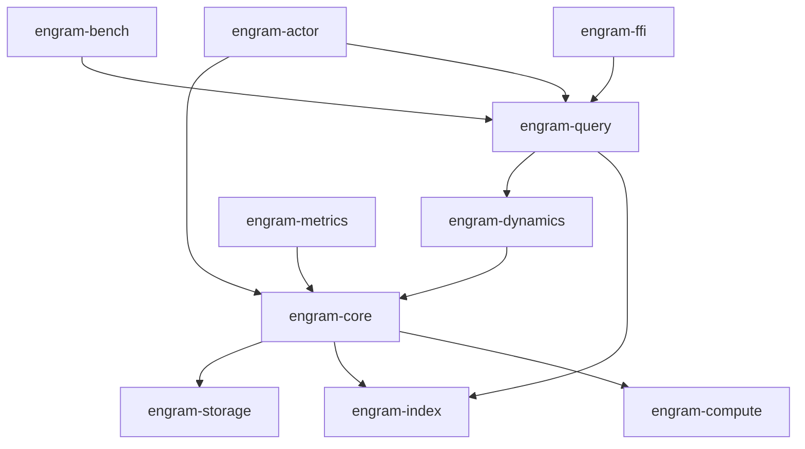

# Core Packages

## engram-core
Primary graph engine with probabilistic operations.

### Modules
- `graph`: Node and edge structures with confidence intervals
- `activation`: Spreading activation engine with decay functions
- `temporal`: Time-based operations and decay curves
- `probability`: Probabilistic query primitives

### Exports
- Core types: `MemoryNode`, `MemoryEdge`, `ActivationState`
- Traits: `Activatable`, `Decayable`, `Reconstructable`

## engram-storage
Tiered storage system with migration policies.

### Modules
- `hot`: Lock-free concurrent hashmap
- `warm`: Append-only log with compression
- `cold`: Columnar embedding storage
- `migration`: Inter-tier movement policies

### Exports
- Storage traits: `StorageTier`, `Migratable`
- Concrete implementations per tier

## engram-index
Indexing structures for content-addressable retrieval.

### Modules
- `hnsw`: Hierarchical navigable small world graphs
- `lsh`: Locality-sensitive hashing for approximate search
- `temporal_index`: Time-range query acceleration

### Exports
- Index traits: `VectorIndex`, `TemporalIndex`
- Builder patterns for index construction

## engram-compute
Numerical operations and GPU acceleration.

### Modules
- `kernels`: Zig-implemented performance kernels
- `gpu`: CUDA/ROCm integration
- `simd`: Vectorized CPU operations
- `embedding`: Embedding manipulation operations

### Exports
- Compute traits: `EmbeddingOps`, `BatchActivation`
- Runtime GPU detection and fallback

## engram-dynamics
Cognitive dynamics and learning rules.

### Modules
- `hebbian`: Weight adjustment mechanisms
- `consolidation`: Episode-to-semantic transformation
- `reconstruction`: Pattern completion algorithms
- `decay`: Forgetting curve implementations

### Exports
- Learning traits: `LearningRule`, `Consolidator`
- Standard cognitive functions

## engram-query
Query language and execution engine.

### Modules
- `parser`: Query language AST
- `planner`: Activation-based query planning
- `executor`: Probabilistic execution engine
- `stream`: Async result streaming

### Exports
- Query types: `Query`, `QueryResult`, `ConfidenceScore`
- Execution traits: `QueryExecutor`

## engram-actor
Actor-based distribution system.

### Modules
- `region`: Memory region actors
- `gossip`: Inter-region communication
- `partition`: Graph partitioning strategies
- `routing`: Activation message routing

### Exports
- Actor traits: `MemoryRegion`, `MessageHandler`
- Distribution strategies

## engram-metrics
Observability and profiling.

### Modules
- `activation_metrics`: Spreading patterns
- `memory_metrics`: Formation and decay rates
- `performance_metrics`: Latency and throughput
- `cognitive_metrics`: Retrieval accuracy

### Exports
- Metric types: `ActivationHistogram`, `DecayProfile`
- Streaming metrics exporters (JSON/log based)

## engram-bench
Cognitive-realistic benchmarking suite.

### Modules
- `episodic_bench`: Sequential memory tasks
- `semantic_bench`: Category formation tasks
- `interference_bench`: Memory competition patterns
- `consolidation_bench`: Long-term memory formation

### Exports
- Benchmark harness
- Comparison tools against baselines

## engram-ffi
Foreign function interface for polyglot integration.

### Modules
- `c_api`: C-compatible interface
- `wasm`: WebAssembly bindings
- `zig_bridge`: Direct Zig interop

### Exports
- Stable ABI definitions
- Language-specific bindings

## Package Dependencies

## Development Priorities

1. `engram-core`: Foundation, must be correct before optimization
2. `engram-storage`: Required for persistence testing
3. `engram-dynamics`: Validates cognitive principles
4. `engram-compute`: Performance optimization phase
5. `engram-query`: User-facing interface
6. `engram-index`: Query acceleration
7. `engram-actor`: Distribution capability
8. `engram-metrics`: Production observability
9. `engram-bench`: Performance validation
10. `engram-ffi`: External integration

## Version Management

All packages version together. Single version number for entire project.
Breaking changes in any package trigger major version increment for all.

## Testing Strategy

Each package maintains:
- Unit tests: >90% coverage
- Integration tests: Cross-package interactions
- Benchmarks: Performance regression detection
- Fuzzing harness: Edge case discovery

## Documentation Requirements

Each package includes:
- README with usage examples
- API documentation with cognitive theory references
- Architectural decision records
- Performance characteristics documentation
