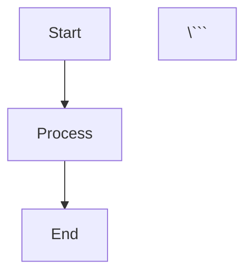

# Architecture Diagrams

This directory contains comprehensive architecture diagrams for Engram's streaming infrastructure and cognitive patterns. All diagrams are provided in both Mermaid (for GitHub/VitePress rendering) and ASCII art (for terminal/text viewing).

## Quick Start

**New to Engram?** Start with the [System Architecture Overview](system-architecture-overview.md) for a high-level understanding of all components and their interactions.

## System Overview

### 0. System Architecture Overview
**File**: `system-architecture-overview.md`

Complete system architecture showing all layers and components:
- Client layer (gRPC, WebSocket, HTTP, SDKs)
- API layer (streaming and batch handlers)
- Core layer (streaming, memory, cognitive, query)
- Storage layer (hot/warm/cold tiers)
- Monitoring layer (metrics, Prometheus, Grafana)
- Data flow diagrams (write and read paths)
- Technology stack and deployment architectures

**Key Concepts**:
- Multi-layer architecture
- Data flow patterns
- Component interactions
- Scalability model
- Performance profile

**Use Cases**:
- Understanding overall system design
- Architecture reviews and planning
- Onboarding new developers
- Capacity planning and deployment

## Streaming Architecture (Milestone 11)

### 1. ObservationQueue Flow
**File**: `observation-queue-flow.md`

Explains the complete observation ingestion pipeline from client to storage:
- gRPC/WebSocket client connections
- Session management with state machines
- Lock-free 3-priority queue (High/Normal/Low)
- Worker pool with space partitioning
- HNSW graph insertion with generation tracking
- Backpressure signaling and flow control

**Key Concepts**:
- Lock-free queue architecture
- Session lifecycle (Init → Active → Paused → Closed)
- Sequence validation and monotonic ordering
- Generation-based snapshot isolation
- Observation acknowledgment flow

**Use Cases**:
- Understanding the streaming ingestion path
- Debugging observation processing issues
- Optimizing throughput and latency
- Implementing client-side retry logic

### 2. Space-Partitioned HNSW
**File**: `space-partitioned-hnsw.md`

Details the zero-contention multi-tenant architecture:
- Memory space isolation via DashMap
- Independent HNSW graphs per space
- Work stealing for load balancing
- Worker assignment strategies
- Performance scaling analysis

**Key Concepts**:
- Zero cross-space locks
- Linear throughput scaling
- Work stealing threshold (1000 observations)
- Adaptive batch sizing
- NUMA-aware worker pinning

**Use Cases**:
- Multi-tenant deployment planning
- Understanding parallelism guarantees
- Capacity planning for space count
- Performance tuning for skewed workloads

### 3. Backpressure Mechanism
**File**: `backpressure-mechanism.md`

Covers the adaptive admission control system:
- State machine (Normal → Warning → Backpressure → Critical)
- Queue depth monitoring and thresholds
- Client pause/resume signaling
- Adaptive batch sizing
- Recovery dynamics

**Key Concepts**:
- Backpressure states and transitions
- Little's Law application
- Exponential backoff strategies
- Batch size curves
- Monitoring metrics

**Use Cases**:
- Handling traffic spikes
- Implementing client-side backpressure
- Tuning queue capacities
- Monitoring production health

## Cognitive Patterns (Milestone 13)

### 4. Cognitive Patterns Flow
**File**: `cognitive-patterns-flow.md`

Comprehensive guide to psychological phenomena in Engram:
- Semantic priming (Collins & Loftus 1975)
- Proactive/retroactive interference
- Fan effect (Anderson 1974)
- Reconsolidation (Nader et al. 2000)
- Integration with recall pipeline

**Key Concepts**:
- Priming activation spread and decay
- Interference detection and confidence adjustment
- Fan effect RT penalties
- Reconsolidation temporal windows
- Biological constraint boundaries

**Use Cases**:
- Understanding cognitive dynamics
- Validating empirical accuracy
- Debugging confidence scores
- Implementing human-like memory behavior

### 5. Memory Consolidation Pipeline
**File**: `memory-consolidation-pipeline.md`

End-to-end memory lifecycle from encoding to long-term storage:
- Encoding phase (working memory)
- Short-term storage (hippocampus analog)
- Consolidation process (pattern extraction)
- Long-term storage (neocortex analog)
- Reconsolidation loop

**Key Concepts**:
- State transitions (Fresh → Labile → Consolidated)
- Decay rate changes (0.5 → 0.1 → 0.01)
- Pattern extraction and schema formation
- Activation replay and pruning
- Plasticity windows

**Use Cases**:
- Understanding memory stability
- Implementing forgetting curves
- Schema-based retrieval
- Memory modification policies

## Diagram Formats

### Mermaid Diagrams
All diagrams include Mermaid syntax for embedding in markdown:

```markdown


**Rendering**:
- GitHub automatically renders Mermaid in markdown
- VitePress supports Mermaid via plugin
- Mermaid Live Editor: https://mermaid.live/

### ASCII Diagrams
Text-based diagrams for terminal viewing and documentation:

```
┌─────────────────┐
│  Component A    │
│  ┌───────────┐  │
│  │ Detail    │  │
│  └───────────┘  │
└────────┬────────┘
         │
         ▼
┌─────────────────┐
│  Component B    │
└─────────────────┘
```

**Benefits**:
- Works in any text environment
- No rendering dependencies
- Copy-paste friendly
- Version control friendly

## Integration with Documentation

These diagrams are referenced in:

### Streaming Documentation
- `docs/operations/streaming.md` - Production deployment guide
- `docs/reference/streaming-performance-analysis.md` - Performance benchmarks
- `docs/howto/backpressure-handling.md` - Client implementation guide

### Cognitive Pattern Documentation
- `docs/explanation/cognitive-patterns.md` - Theoretical foundations
- `docs/reference/priming-api.md` - Priming API reference
- `docs/reference/reconsolidation-api.md` - Reconsolidation API reference

## Diagram Conventions

### Visual Language
- **Boxes**: Components, modules, or states
- **Arrows**: Data flow (→) or control flow (⇒)
- **Dotted lines**: Optional or conditional paths
- **Colors**:
  - Red/Pink: High priority or critical states
  - Blue: Normal operations
  - Green: Success states or long-term storage
  - Yellow: Warning states or transitions
  - Purple: Special processes (reconsolidation)

### Naming Conventions
- **PascalCase**: Types and components (ObservationQueue, HnswGraph)
- **snake_case**: Variables and fields (queue_depth, decay_rate)
- **SCREAMING_CASE**: States and constants (BACKPRESSURE, LABILE)
- **kebab-case**: File names (observation-queue-flow.md)

### Metrics and Numbers
- All latency targets include percentile (P50, P99)
- Throughput in observations/second (obs/sec)
- Memory in MB/GB with context (per worker, total)
- Percentages for thresholds (85% capacity)

## Updating Diagrams

### When to Update
- Architecture changes (new components, flow modifications)
- Performance target changes (latency, throughput)
- Boundary condition adjustments (cognitive patterns)
- Bug fixes that affect control flow

### Update Process
1. Edit both Mermaid and ASCII versions
2. Verify Mermaid renders correctly (Mermaid Live Editor)
3. Test ASCII alignment in terminal (80-column width)
4. Update "Last Updated" date in diagram file
5. Reference updated diagram in relevant documentation
6. Commit with descriptive message

### Style Guide
- Keep diagrams focused (one concept per diagram)
- Use consistent spacing and alignment
- Include legends for complex symbols
- Add timestamps for temporal diagrams
- Provide concrete examples with realistic values
- Reference empirical papers for cognitive patterns

## Examples and Use Cases

### For Developers
**Understanding Streaming Architecture**:
1. Read `observation-queue-flow.md` for end-to-end flow
2. Study `space-partitioned-hnsw.md` for parallelism
3. Review `backpressure-mechanism.md` for failure modes

**Implementing Cognitive Features**:
1. Start with `cognitive-patterns-flow.md` for overview
2. Deep dive into specific pattern (priming, interference, reconsolidation)
3. Follow `memory-consolidation-pipeline.md` for lifecycle

### For Operators
**Monitoring Production**:
- Use backpressure state diagram to interpret alerts
- Reference throughput scaling tables for capacity planning
- Check memory footprint tables for resource allocation

**Debugging Issues**:
- Trace observation path through queue flow diagram
- Identify bottlenecks using performance characteristics tables
- Validate state transitions against state machines

### For Researchers
**Validating Cognitive Accuracy**:
- Compare priming decay curves to Neely (1977)
- Verify fan effect RT formula against Anderson (1974)
- Check reconsolidation windows against Nader et al. (2000)

**Exploring Extensions**:
- Identify integration points in consolidated pipeline
- Understand constraints in cognitive pattern boundaries
- Locate optimization opportunities in performance tables

## References

### Streaming Architecture
- Little's Law: Little, J. (1961). "A proof for the queuing formula: L = λW"
- Lock-free Queues: Michael & Scott (1996). "Non-blocking concurrent queue algorithms"
- Work Stealing: Chase & Lev (2005). "Dynamic circular work-stealing deque"
- HNSW: Malkov & Yashunin (2018). "Efficient approximate nearest neighbor search"

### Cognitive Patterns
- Semantic Priming: Collins & Loftus (1975). "A spreading-activation theory of semantic processing"
- Priming Dynamics: Neely (1977). "Semantic priming and retrieval from lexical memory"
- Interference: Underwood (1957). "Interference and forgetting"
- Fan Effect: Anderson (1974). "Retrieval of propositional information from long-term memory"
- Reconsolidation: Nader et al. (2000). "Fear memories require protein synthesis for reconsolidation"
- Plasticity Dynamics: Nader & Einarsson (2010). "Memory reconsolidation: an update"

## Contributing

When adding new diagrams:
1. Follow existing format (Mermaid + ASCII + detailed explanation)
2. Include performance characteristics and metrics
3. Reference empirical research where applicable
4. Provide concrete examples with realistic values
5. Update this README with new diagram entry
6. Cross-reference in relevant documentation

## License

These diagrams are part of the Engram project and follow the same license.
All empirical data references are cited with original publications.
