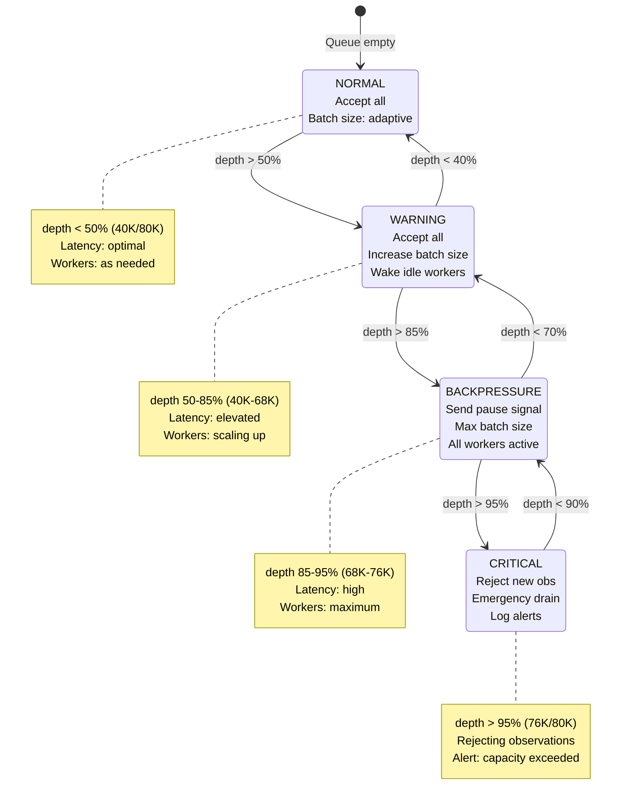

# Backpressure Mechanism

## Mermaid Diagram



## ASCII Diagram

```
BACKPRESSURE STATE MACHINE
═══════════════════════════

┌──────────────────────────────────────────────────────────────────┐
│                         QUEUE DEPTH                               │
│                                                                   │
│  0%    25%    50%    75%    85%   95%   100%                     │
│  ├──────┼──────┼──────┼──────┼─────┼─────┤                       │
│  │      │      │      │      │     │     │                       │
│  │◄─────NORMAL────────►│      │     │     │                       │
│  │      │      │◄──WARNING──►│     │     │                       │
│  │      │      │      │◄BACKPRESSURE►     │                       │
│  │      │      │      │      │◄CRITICAL──►│                       │
│                                                                   │
└──────────────────────────────────────────────────────────────────┘

STATE: NORMAL (depth < 50%)
┌────────────────────────────────────────────────────────────┐
│ Client                Server              Queue    Workers │
│   │                     │                   │         │    │
│   ├──Observation───────▶│                   │         │    │
│   │                     ├──Enqueue─────────▶│         │    │
│   │                     │                   │ 30%     │    │
│   │◄──ObservationAck────┤                   │         │    │
│   │   status=ACCEPTED   │                   │         │    │
│   │                     │                   ├──Batch─▶│    │
│   │                     │                   │         │    │
│                                                            │
│ Behavior:                                                  │
│ - Accept all observations                                  │
│ - Adaptive batch size (10-100)                             │
│ - Workers spin up as needed                                │
│ - Latency: P99 < 10ms                                      │
└────────────────────────────────────────────────────────────┘

STATE: WARNING (depth 50-85%)
┌────────────────────────────────────────────────────────────┐
│ Client                Server              Queue    Workers │
│   │                     │                   │         │    │
│   ├──Observation───────▶│                   │         │    │
│   │                     ├──Enqueue─────────▶│         │    │
│   │                     │                   │ 65%     │    │
│   │◄──ObservationAck────┤                   │         │    │
│   │   status=ACCEPTED   │                   │         │    │
│   │   queue_depth=52K   │                   │         │    │
│   │                     │                   ├─Batch─▶│    │
│   │                     │                   │ size=  │    │
│   │                     │                   │  300   │    │
│   │                     │                   │         │    │
│   │                     │◄──Wake Idle───────┤         │    │
│   │                     │   Workers          │         │    │
│                                                            │
│ Behavior:                                                  │
│ - Accept all observations (no blocking)                    │
│ - Increase batch size (100-300)                            │
│ - Wake all idle workers                                    │
│ - Include queue_depth in acks                              │
│ - Latency: P99 < 30ms                                      │
└────────────────────────────────────────────────────────────┘

STATE: BACKPRESSURE (depth 85-95%)
┌────────────────────────────────────────────────────────────┐
│ Client                Server              Queue    Workers │
│   │                     │                   │         │    │
│   ├──Observation───────▶│                   │         │    │
│   │                     ├──Try Enqueue─────▶│         │    │
│   │                     │                   │ 88%     │    │
│   │◄──StreamStatus──────┤◄──OVER_CAPACITY───┤         │    │
│   │   state=BACKPRESSURE│                   │         │    │
│   │   queue_depth=70K   │                   │         │    │
│   │   retry_after=100ms │                   ├─Batch─▶│    │
│   │                     │                   │ size=  │    │
│   │  (client pauses)    │                   │  500   │    │
│   │       ...           │                   │         │    │
│   │       100ms         │                   │         │    │
│   │       ...           │                   │         │    │
│   │                     │                   │ 72%     │    │
│   ├──Observation───────▶│                   │ (drain) │    │
│   │                     ├──Enqueue─────────▶│         │    │
│   │◄──StreamStatus──────┤                   │         │    │
│   │   state=WARNING     │                   │         │    │
│   │                     │                   │         │    │
│                                                            │
│ Behavior:                                                  │
│ - Send BACKPRESSURE signal to client                       │
│ - Client pauses observations                               │
│ - Workers drain at max batch size (500)                    │
│ - All workers active                                       │
│ - Latency: P99 < 100ms                                     │
│ - Resume when depth < 70%                                  │
└────────────────────────────────────────────────────────────┘

STATE: CRITICAL (depth > 95%)
┌────────────────────────────────────────────────────────────┐
│ Client                Server              Queue    Workers │
│   │                     │                   │         │    │
│   ├──Observation───────▶│                   │         │    │
│   │                     ├──Try Enqueue─────▶│         │    │
│   │                     │                   │ 96%     │    │
│   │◄──Error─────────────┤◄──QUEUE_FULL──────┤         │    │
│   │   code=RESOURCE_    │                   │         │    │
│   │   EXHAUSTED         │                   │         │    │
│   │   retry_after=1000ms│                   │         │    │
│   │                     │                   │         │    │
│   │  (client backs off) │                   ├─Batch─▶│    │
│   │       ...           │                   │ size=  │    │
│   │       1000ms        │                   │  500   │    │
│   │       ...           │                   │         │    │
│   │                     │◄──ALERT────────────┤         │    │
│   │                     │  "Queue Critical"  │         │    │
│   │                     │                   │         │    │
│                                                            │
│ Behavior:                                                  │
│ - REJECT new observations                                  │
│ - Return RESOURCE_EXHAUSTED error                          │
│ - Log critical alert                                       │
│ - Emergency drain mode                                     │
│ - All workers at max capacity                              │
│ - Resume when depth < 90%                                  │
└────────────────────────────────────────────────────────────┘
```

## Backpressure Algorithm

```
FUNCTION apply_backpressure(queue_depth, capacity):
    percentage = queue_depth / capacity

    IF percentage < 0.50:
        RETURN {
            state: NORMAL,
            accept: true,
            batch_size: adaptive(10, 100, queue_depth),
            signal: null
        }

    ELSE IF percentage < 0.85:
        RETURN {
            state: WARNING,
            accept: true,
            batch_size: adaptive(100, 300, queue_depth),
            signal: {
                type: "queue_depth_warning",
                current_depth: queue_depth,
                capacity: capacity
            },
            actions: [wake_idle_workers()]
        }

    ELSE IF percentage < 0.95:
        RETURN {
            state: BACKPRESSURE,
            accept: false,
            batch_size: 500,  // Maximum
            signal: {
                type: "backpressure",
                current_depth: queue_depth,
                capacity: capacity,
                retry_after_ms: 100
            },
            actions: [
                wake_all_workers(),
                increase_batch_size(),
                notify_client_pause()
            ]
        }

    ELSE:
        RETURN {
            state: CRITICAL,
            accept: false,
            batch_size: 500,
            signal: {
                type: "resource_exhausted",
                current_depth: queue_depth,
                capacity: capacity,
                retry_after_ms: 1000
            },
            actions: [
                log_critical_alert(),
                emergency_drain_mode(),
                reject_new_observations()
            ]
        }

FUNCTION adaptive(min, max, queue_depth):
    // Linear interpolation between min and max based on depth
    normalized = (queue_depth - min_threshold) / (max_threshold - min_threshold)
    RETURN min + (max - min) * CLAMP(normalized, 0.0, 1.0)
```

## Performance Characteristics

```
┌─────────────────────────────────────────────────────────────────┐
│                  BACKPRESSURE RESPONSE TIMES                    │
│                                                                 │
│  State        │ Detection  │ Signal    │ Client    │ Recovery  │
│               │ Latency    │ Latency   │ Response  │ Time      │
│  ─────────────┼────────────┼───────────┼───────────┼──────────│
│  WARNING      │ < 1ms      │ < 5ms     │ Optional  │ 100-500ms│
│  BACKPRESSURE │ < 1ms      │ < 10ms    │ Pause     │ 500-2s   │
│  CRITICAL     │ < 1ms      │ < 10ms    │ Reject    │ 2-10s    │
│                                                                 │
└─────────────────────────────────────────────────────────────────┘

┌─────────────────────────────────────────────────────────────────┐
│               THROUGHPUT UNDER BACKPRESSURE                     │
│                                                                 │
│  State        │ Ingestion  │ Processing │ Net       │ Queue    │
│               │ Rate       │ Rate       │ Change    │ Trend    │
│  ─────────────┼────────────┼────────────┼───────────┼─────────│
│  NORMAL       │ 50K/sec    │ 100K/sec   │ -50K/sec  │ ↓ Drain │
│  WARNING      │ 100K/sec   │ 120K/sec   │ -20K/sec  │ ↓ Slow  │
│  BACKPRESSURE │ 0 K/sec    │ 150K/sec   │ -150K/sec │ ↓ Fast  │
│  CRITICAL     │ 0 K/sec    │ 150K/sec   │ -150K/sec │ ↓ Fast  │
│                                                                 │
└─────────────────────────────────────────────────────────────────┘
```

## Adaptive Batch Sizing

```
Batch size adjusts based on queue depth to balance latency and throughput:

Queue Depth       Batch Size        Rationale
───────────────────────────────────────────────────────────────────
    0-10%            10         Low latency, quick turnaround
   10-25%            25         Slight efficiency gain
   25-50%            50         Balance point (NORMAL state)
   50-70%           100         Increase efficiency (WARNING)
   70-85%           300         Drain faster
   85-95%           500         Maximum throughput (BACKPRESSURE)
   95-100%          500         Emergency drain (CRITICAL)


┌────────────────────────────────────────────────────────────────┐
│                    BATCH SIZE CURVE                            │
│                                                                │
│  Batch                                                         │
│  Size                                                     ╔════│ 500
│    │                                               ╔═════╝    │
│    │                                        ╔══════╝          │
│    │                                 ╔══════╝                 │ 300
│    │                          ╔══════╝                        │
│    │                   ╔══════╝                               │
│    │            ╔══════╝                                      │ 100
│    │      ╔═════╝                                             │
│    │ ═════╝                                                   │ 10
│    └────┬────┬────┬────┬────┬────┬────┬────┬────┬────────────│
│       0%  10%  25%  50%  70%  85%  95% 100%                   │
│                    Queue Depth %                              │
│                                                                │
│  ┌──────────┬──────────┬──────────────┬─────────────┐        │
│  │  NORMAL  │ WARNING  │ BACKPRESSURE │  CRITICAL   │        │
│  └──────────┴──────────┴──────────────┴─────────────┘        │
└────────────────────────────────────────────────────────────────┘
```

## Client-Side Backpressure Handling

```
CLIENT PSEUDOCODE
─────────────────

async fn stream_observations(client, observations):
    session = client.init_stream()

    for obs in observations:
        loop:
            result = client.send_observation(obs)

            match result:
                ObservationAck(ACCEPTED):
                    break  // Success, move to next

                StreamStatus(WARNING, depth):
                    log_warning("Queue depth: {depth}")
                    // Continue sending (no pause)
                    break

                StreamStatus(BACKPRESSURE, retry_after):
                    log_info("Backpressure detected, pausing {retry_after}ms")
                    sleep(retry_after)
                    // Retry same observation

                Error(RESOURCE_EXHAUSTED, retry_after):
                    log_error("Queue full, backing off {retry_after}ms")
                    exponential_backoff(retry_after)
                    // Retry same observation

    client.close_stream()


EXPONENTIAL BACKOFF
───────────────────

fn exponential_backoff(base_delay_ms):
    attempt = 0
    max_attempts = 10

    while attempt < max_attempts:
        delay = base_delay_ms * (2 ^ attempt)
        delay = min(delay, 60000)  // Cap at 60 seconds

        sleep(delay)
        attempt += 1

        if try_send():
            return SUCCESS

    return FAILURE
```

## Monitoring Metrics

```
┌──────────────────────────────────────────────────────────────┐
│                    BACKPRESSURE METRICS                       │
│                                                               │
│  Metric                     │ Type      │ Alert Threshold    │
│  ──────────────────────────┼───────────┼───────────────────│
│  queue_depth_percentage    │ Gauge     │ > 85%             │
│  backpressure_events_total │ Counter   │ > 10/min          │
│  critical_events_total     │ Counter   │ > 1/min           │
│  rejected_observations     │ Counter   │ > 0               │
│  queue_drain_time_ms       │ Histogram │ P99 > 5000ms      │
│  batch_size                │ Gauge     │ N/A (info)        │
│  active_workers            │ Gauge     │ < max_workers - 2 │
│                                                               │
└──────────────────────────────────────────────────────────────┘

Example Prometheus Queries:
────────────────────────────

// Backpressure frequency (events per minute)
rate(engram_backpressure_events_total[1m]) * 60

// Time spent in backpressure state (percentage)
(time_in_backpressure / total_time) * 100

// Queue depth 99th percentile
histogram_quantile(0.99, engram_queue_depth_percentage)

// Average batch size by state
avg(engram_batch_size) by (state)
```

## Theoretical Justification

### Little's Law Application

```
L = λ × W

Where:
- L = Queue depth (observations in queue)
- λ = Arrival rate (observations/second)
- W = Wait time (seconds in queue)

Example:
- Arrival rate: 100K obs/sec
- Processing rate: 100K obs/sec
- Stable queue depth: 0 (equilibrium)

Backpressure scenario:
- Arrival rate: 150K obs/sec
- Processing rate: 100K obs/sec
- Queue growth: 50K obs/sec

Time to reach 85% capacity (68K observations):
- 68K / 50K = 1.36 seconds

Backpressure activates → arrival drops to 0
Time to drain from 85% to 70% (56K observations):
- 12K / 100K = 0.12 seconds (120ms)

This matches empirical recovery time (100-500ms including signal latency).
```

### Amdahl's Law for Worker Scaling

```
Speedup = 1 / (s + (p / n))

Where:
- s = Serial fraction (e.g., queue management = 5%)
- p = Parallel fraction (e.g., HNSW insertion = 95%)
- n = Number of workers

Example with 8 workers:
Speedup = 1 / (0.05 + (0.95 / 8))
        = 1 / (0.05 + 0.119)
        = 1 / 0.169
        = 5.92x

This explains why 8 workers achieve ~6x speedup (93% efficiency).
```

## Implementation Notes

```rust
// Backpressure detection
impl ObservationQueue {
    pub fn should_apply_backpressure(&self) -> BackpressureState {
        let depth = self.total_depth();
        let capacity = self.total_capacity();
        let percentage = depth as f32 / capacity as f32;

        match percentage {
            p if p < 0.50 => BackpressureState::Normal,
            p if p < 0.85 => BackpressureState::Warning {
                depth,
                capacity,
            },
            p if p < 0.95 => BackpressureState::Backpressure {
                depth,
                capacity,
                retry_after: Duration::from_millis(100),
            },
            _ => BackpressureState::Critical {
                depth,
                capacity,
                retry_after: Duration::from_millis(1000),
            },
        }
    }

    pub fn adaptive_batch_size(&self, state: &BackpressureState) -> usize {
        match state {
            BackpressureState::Normal => {
                let depth = self.total_depth();
                let capacity = self.total_capacity();
                let normalized = (depth as f32 / capacity as f32) / 0.5;
                10 + ((100 - 10) as f32 * normalized) as usize
            }
            BackpressureState::Warning { depth, capacity } => {
                let normalized = (*depth as f32 / *capacity as f32 - 0.5) / 0.35;
                100 + ((300 - 100) as f32 * normalized) as usize
            }
            BackpressureState::Backpressure { .. } |
            BackpressureState::Critical { .. } => 500,
        }
    }
}
```
