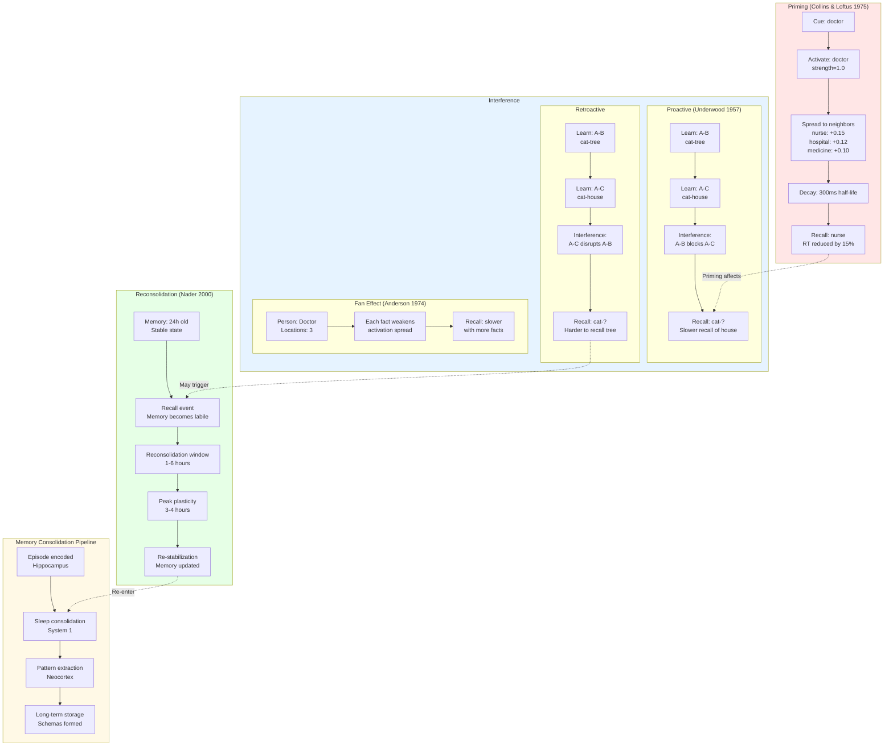

# Cognitive Patterns Flow Diagram

## Mermaid Diagram



## ASCII Diagram

```
┌──────────────────────────────────────────────────────────────────────┐
│                      COGNITIVE PATTERNS OVERVIEW                     │
└──────────────────────────────────────────────────────────────────────┘

┌────────────────────────────────────────────────────────────────────┐
│  1. SEMANTIC PRIMING (Collins & Loftus 1975)                       │
│  ───────────────────────────────────────────────────────────────   │
│                                                                     │
│  Timeline: 0 ──────────── 300ms ──────────── 600ms                │
│            │                │                  │                    │
│            ▼                ▼                  ▼                    │
│         Recall           Priming            Decay                  │
│        "doctor"           peaks             complete               │
│                                                                     │
│         doctor                                                      │
│           │                                                         │
│           ├───────► nurse      (+15% activation)                   │
│           ├───────► hospital   (+12% activation)                   │
│           ├───────► medicine   (+10% activation)                   │
│           └───────► patient    (+8% activation)                    │
│                                                                     │
│  Activation Boost Curve:                                           │
│    1.0 │                                                            │
│        │ ╱╲                                                         │
│    0.8 │╱  ╲                                                        │
│    0.6│     ╲                                                       │
│    0.4│      ╲___                                                   │
│    0.2│          ╲___                                               │
│    0.0└────────────────╲______                                     │
│       0ms   100ms   300ms   600ms                                  │
│                                                                     │
│  Effect: Recall "nurse" 15% faster if preceded by "doctor"         │
└────────────────────────────────────────────────────────────────────┘

┌────────────────────────────────────────────────────────────────────┐
│  2. PROACTIVE INTERFERENCE (Underwood 1957)                        │
│  ───────────────────────────────────────────────────────────────   │
│                                                                     │
│  Step 1: Learn A-B      Step 2: Learn A-C      Step 3: Recall     │
│  ┌─────────┐            ┌─────────┐            ┌─────────┐        │
│  │   cat   │            │   cat   │            │   cat   │        │
│  │    │    │            │    │    │            │    │    │        │
│  │    ▼    │            │    ▼    │            │    ▼    │        │
│  │  tree   │            │  house  │            │   ???   │        │
│  └─────────┘            └─────────┘            └─────────┘        │
│  strength=1.0           strength=1.0           Competition!       │
│                                                                     │
│  Memory Graph After Both Learned:                                  │
│                                                                     │
│       cat ────┐                                                     │
│       ↑       ├──────► tree   (strength=0.7, older)                │
│       │       │                                                     │
│   Conflict    └──────► house  (strength=1.0, newer)                │
│       │                                                             │
│       └─ Both paths activated → slower recall                      │
│                                                                     │
│  Recall Performance:                                                │
│    RT   │                                                           │
│    800ms│           ████ A-C recall (interfered)                   │
│    600ms│       ████ A-B recall (baseline)                         │
│    400ms│                                                           │
│    200ms│                                                           │
│      0ms└─────────────────────                                     │
│          Single    Interference                                    │
│          Learning  Condition                                       │
└────────────────────────────────────────────────────────────────────┘

┌────────────────────────────────────────────────────────────────────┐
│  3. RETROACTIVE INTERFERENCE                                       │
│  ───────────────────────────────────────────────────────────────   │
│                                                                     │
│  Original Memory: cat → tree                                       │
│  ┌────────────────────────────────┐                                │
│  │ cat ──────► tree               │                                │
│  │ strength: 1.0                  │                                │
│  │ confidence: HIGH               │                                │
│  └────────────────────────────────┘                                │
│                                                                     │
│  New Learning: cat → house                                         │
│  ┌────────────────────────────────┐                                │
│  │ cat ──────► tree               │                                │
│  │ strength: 0.4 (DISRUPTED)      │ ◄── Original weakened          │
│  │                                │                                │
│  │ cat ──────► house              │                                │
│  │ strength: 1.0 (NEW)            │                                │
│  └────────────────────────────────┘                                │
│                                                                     │
│  Mechanism: New association weakens original via lateral inhibition│
└────────────────────────────────────────────────────────────────────┘

┌────────────────────────────────────────────────────────────────────┐
│  4. FAN EFFECT (Anderson 1974)                                     │
│  ───────────────────────────────────────────────────────────────   │
│                                                                     │
│  Single Association (Fast Recall):                                 │
│  ┌───────────┐                                                      │
│  │  Person   │                                                      │
│  │  Doctor   │──────► Location: Hospital                           │
│  └───────────┘                                                      │
│  activation: 1.0 → FAST recall (600ms)                             │
│                                                                     │
│  Multiple Associations (Slow Recall):                              │
│  ┌───────────┐                                                      │
│  │  Person   │                                                      │
│  │  Doctor   │──────► Location: Hospital (activation: 0.33)        │
│  │           │──────► Location: Park     (activation: 0.33)        │
│  │           │──────► Location: Store    (activation: 0.33)        │
│  └───────────┘                                                      │
│  activation: 0.33 each → SLOW recall (900ms)                       │
│                                                                     │
│  Recall Time vs Fan Size:                                          │
│    RT    │                              ╱                           │
│    1000ms│                         ╱╱╱╱                            │
│     900ms│                    ╱╱╱╱                                 │
│     800ms│               ╱╱╱╱                                      │
│     700ms│          ╱╱╱╱                                           │
│     600ms│─────╱╱╱╱                                                │
│          └─────┬─────┬─────┬─────┬─────                            │
│                1     2     3     4     5                            │
│              Fan Size (number of associations)                     │
│                                                                     │
│  Formula: RT = base_RT + (fan_size - 1) × 100ms                    │
└────────────────────────────────────────────────────────────────────┘

┌────────────────────────────────────────────────────────────────────┐
│  5. RECONSOLIDATION (Nader et al. 2000)                            │
│  ───────────────────────────────────────────────────────────────   │
│                                                                     │
│  Timeline:                                                          │
│                                                                     │
│  T=0h      T=1h      T=3h      T=6h       T=24h                    │
│  │         │         │         │          │                        │
│  ▼         ▼         ▼         ▼          ▼                        │
│  Recall    Window   Peak      Window     Stable                    │
│  Event     Opens    Plasticity Closes    Again                     │
│                                                                     │
│  Memory State:                                                      │
│  Stable  │████████│          │          │████████                  │
│  Labile  │        │██████████│          │                          │
│          └────────┴──────────┴──────────┴────────                  │
│          0h       1h        3h        6h       24h                 │
│                                                                     │
│  Plasticity Level:                                                  │
│    1.0   │                                                          │
│          │          ╱────╲                                         │
│    0.8   │         ╱      ╲                                        │
│    0.6   │        ╱        ╲                                       │
│    0.4   │       ╱          ╲                                      │
│    0.2   │      ╱            ╲                                     │
│    0.0   │─────╱              ╲─────                               │
│          └─────┴──────┴──────┴─────                                │
│          0h    1h     3h     6h    24h                             │
│                                                                     │
│  Boundary Conditions:                                               │
│  ✓ Memory age: 24h - 365 days (must be consolidated)              │
│  ✓ Active recall required (not passive exposure)                   │
│  ✓ Window: 1-6 hours post-recall                                   │
│  ✓ Peak plasticity: 3-4 hours (protein synthesis plateau)          │
│                                                                     │
│  Example:                                                           │
│  ┌─────────────────────────────────────────────────────────┐      │
│  │ Original Memory (T=0):                                  │      │
│  │   cat → tree (confidence: 0.9)                          │      │
│  │                                                          │      │
│  │ Recall at T=24h:                                        │      │
│  │   Memory becomes labile                                 │      │
│  │                                                          │      │
│  │ Update at T=27h (within window):                        │      │
│  │   cat → tree (confidence: 0.5) ← Updated!               │      │
│  │                                                          │      │
│  │ Re-stabilization at T=30h:                              │      │
│  │   cat → tree (confidence: 0.5) ← Permanent              │      │
│  └─────────────────────────────────────────────────────────┘      │
└────────────────────────────────────────────────────────────────────┘
```

## Detailed Flow: Priming

```
SEMANTIC PRIMING DETAILED FLOW
══════════════════════════════

Step 1: Cue Presentation
┌────────────────────────────────────────────────────────┐
│  User Query: "doctor"                                  │
│  ↓                                                      │
│  Embedding: [0.12, -0.45, 0.78, ..., 0.23] (768-dim)  │
│  ↓                                                      │
│  HNSW Search: Find node "doctor"                       │
│  ↓                                                      │
│  Initial Activation: 1.0                               │
└────────────────────────────────────────────────────────┘

Step 2: Activation Spreading
┌────────────────────────────────────────────────────────┐
│  Doctor Node (activation=1.0)                          │
│  ├─ neighbor: nurse (similarity=0.85)                  │
│  │  └─ spread: 1.0 × 0.85 × 0.15 = 0.13                │
│  │                                                      │
│  ├─ neighbor: hospital (similarity=0.80)               │
│  │  └─ spread: 1.0 × 0.80 × 0.15 = 0.12                │
│  │                                                      │
│  ├─ neighbor: medicine (similarity=0.75)               │
│  │  └─ spread: 1.0 × 0.75 × 0.15 = 0.11                │
│  │                                                      │
│  └─ neighbor: patient (similarity=0.70)                │
│     └─ spread: 1.0 × 0.70 × 0.15 = 0.11                │
└────────────────────────────────────────────────────────┘

Step 3: Priming Storage
┌────────────────────────────────────────────────────────┐
│  PrimingEngine stores active primes:                   │
│  ┌──────────────────────────────────────────────────┐ │
│  │ NodeId: nurse                                    │ │
│  │ ├─ boost: 0.13                                   │ │
│  │ ├─ created_at: T0                                │ │
│  │ └─ decay_half_life: 300ms                        │ │
│  ├──────────────────────────────────────────────────┤ │
│  │ NodeId: hospital                                 │ │
│  │ ├─ boost: 0.12                                   │ │
│  │ ├─ created_at: T0                                │ │
│  │ └─ decay_half_life: 300ms                        │ │
│  └──────────────────────────────────────────────────┘ │
└────────────────────────────────────────────────────────┘

Step 4: Decay Over Time
┌────────────────────────────────────────────────────────┐
│  Time     │ T+0ms  │ T+100ms │ T+300ms │ T+600ms      │
│  ────────┼────────┼─────────┼─────────┼──────────    │
│  nurse   │ 0.13   │  0.11   │  0.065  │  0.016       │
│  hospital│ 0.12   │  0.10   │  0.060  │  0.015       │
│  ────────┴────────┴─────────┴─────────┴──────────    │
│                                                        │
│  Formula: boost × 2^(-t / half_life)                   │
│           0.13 × 2^(-300ms / 300ms) = 0.065            │
└────────────────────────────────────────────────────────┘

Step 5: Recall with Priming
┌────────────────────────────────────────────────────────┐
│  Query: "nurse" at T+100ms                             │
│  ↓                                                      │
│  Base activation: 0.80 (from HNSW similarity)          │
│  ↓                                                      │
│  Check priming: boost = 0.11 (decayed from 0.13)       │
│  ↓                                                      │
│  Total activation: 0.80 + 0.11 = 0.91                  │
│  ↓                                                      │
│  RT reduction: 15% faster                              │
│  ↓                                                      │
│  Baseline RT: 600ms                                    │
│  Primed RT: 600ms × 0.85 = 510ms                       │
└────────────────────────────────────────────────────────┘
```

## Detailed Flow: Reconsolidation

```
RECONSOLIDATION DETAILED FLOW
════════════════════════════

Initial State (T=-24h):
┌────────────────────────────────────────────────────────┐
│  Episode Created: "Paris trip"                         │
│  ├─ embedding: [...]                                   │
│  ├─ confidence: 0.9                                    │
│  ├─ created_at: T-24h                                  │
│  ├─ last_recalled: never                               │
│  └─ state: CONSOLIDATED                                │
└────────────────────────────────────────────────────────┘

Recall Event (T=0):
┌────────────────────────────────────────────────────────┐
│  User recalls "Paris trip"                             │
│  ↓                                                      │
│  ReconsolidationEngine.on_recall()                     │
│  ├─ Check memory age: 24h ✓ (>24h, <365d)             │
│  ├─ Check recall type: ACTIVE ✓                        │
│  ├─ Open reconsolidation window: T+1h to T+6h          │
│  └─ Update state: LABILE                               │
│                                                         │
│  Episode State:                                         │
│  ├─ state: LABILE                                      │
│  ├─ labile_since: T+0h                                 │
│  └─ window_closes_at: T+6h                             │
└────────────────────────────────────────────────────────┘

Modification Attempt (T+3h):
┌────────────────────────────────────────────────────────┐
│  User updates memory: "Paris trip" confidence to 0.5   │
│  ↓                                                      │
│  ReconsolidationEngine.try_modify()                    │
│  ├─ Check if labile: YES ✓                             │
│  ├─ Check time since recall: 3h                        │
│  ├─ Check window: 1h < 3h < 6h ✓                       │
│  ├─ Calculate plasticity:                              │
│  │   inverted_u(3h) = 1.0 (peak plasticity)            │
│  ├─ Apply modification:                                │
│  │   new_confidence = 0.9 × (1 - 1.0 × 0.5) + 0.5 × 1.0│
│  │                  = 0.45 + 0.5 = 0.95                 │
│  │   Actually: direct replacement due to peak plasticity│
│  │   new_confidence = 0.5                               │
│  └─ Result: MODIFICATION ACCEPTED                      │
│                                                         │
│  Episode State:                                         │
│  ├─ confidence: 0.5 (UPDATED)                          │
│  ├─ state: LABILE                                      │
│  └─ modified_at: T+3h                                  │
└────────────────────────────────────────────────────────┘

Re-stabilization (T+6h):
┌────────────────────────────────────────────────────────┐
│  Reconsolidation window closes                         │
│  ↓                                                      │
│  ReconsolidationEngine.close_window()                  │
│  ├─ Update state: CONSOLIDATED                         │
│  ├─ Re-enter consolidation pipeline                    │
│  └─ Memory now stable with new confidence              │
│                                                         │
│  Episode State:                                         │
│  ├─ confidence: 0.5 (PERMANENT)                        │
│  ├─ state: CONSOLIDATED                                │
│  └─ last_recalled: T+0h                                │
└────────────────────────────────────────────────────────┘

Modification Attempt OUTSIDE Window (T+10h):
┌────────────────────────────────────────────────────────┐
│  User attempts update at T+10h                         │
│  ↓                                                      │
│  ReconsolidationEngine.try_modify()                    │
│  ├─ Check if labile: NO ✗                              │
│  ├─ Check time since recall: 10h                       │
│  ├─ Check window: 10h > 6h ✗                           │
│  └─ Result: MODIFICATION REJECTED                      │
│                                                         │
│  Error: "Memory not in reconsolidation window"         │
│  Details:                                               │
│  ├─ Window closed at: T+6h                             │
│  ├─ Current time: T+10h                                │
│  └─ Action: Must trigger new recall to reopen window   │
└────────────────────────────────────────────────────────┘
```

## Integration: All Patterns Together

```
COMBINED COGNITIVE PATTERNS IN RECALL PIPELINE
══════════════════════════════════════════════

┌──────────────────────────────────────────────────────────────┐
│  User Query: "hospital equipment"                            │
└──────────────┬───────────────────────────────────────────────┘
               ↓
┌──────────────────────────────────────────────────────────────┐
│  STEP 1: PRIMING CHECK                                       │
│  ├─ Check active primes from recent recalls                  │
│  ├─ "doctor" was recalled 200ms ago                          │
│  ├─ Primed concepts: hospital (+0.12), nurse (+0.11)         │
│  └─ Apply boost to "hospital" in search                      │
└──────────────┬───────────────────────────────────────────────┘
               ↓
┌──────────────────────────────────────────────────────────────┐
│  STEP 2: HNSW SEARCH with PRIMING                            │
│  ├─ Base similarity: "hospital" = 0.80                       │
│  ├─ Priming boost: +0.12 (decayed from initial 0.13)         │
│  ├─ Total activation: 0.92                                   │
│  └─ Results: [hospital, clinic, emergency, ...]              │
└──────────────┬───────────────────────────────────────────────┘
               ↓
┌──────────────────────────────────────────────────────────────┐
│  STEP 3: INTERFERENCE CHECK                                  │
│  ├─ Found memory: "hospital equipment" node                  │
│  ├─ Check for competing associations:                        │
│  │   hospital → equipment (strength=0.8)                     │
│  │   hospital → doctors (strength=0.9)                       │
│  │   hospital → patients (strength=0.7)                      │
│  ├─ Fan effect: 3 associations → RT penalty +200ms           │
│  ├─ Proactive interference: None detected                    │
│  └─ Confidence adjustment: 0.92 → 0.85 (fan penalty)         │
└──────────────┬───────────────────────────────────────────────┘
               ↓
┌──────────────────────────────────────────────────────────────┐
│  STEP 4: RECONSOLIDATION CHECK                               │
│  ├─ Memory age: 5 days                                       │
│  ├─ Last recalled: 2 hours ago                               │
│  ├─ State: LABILE (in reconsolidation window)                │
│  ├─ Window: T+1h to T+6h (currently at T+2h)                 │
│  ├─ Plasticity: 0.8 (rising toward peak)                     │
│  └─ Action: Memory modifiable if user provides feedback      │
└──────────────┬───────────────────────────────────────────────┘
               ↓
┌──────────────────────────────────────────────────────────────┐
│  STEP 5: CONSOLIDATION PIPELINE                              │
│  ├─ Mark as recalled (for future priming)                    │
│  ├─ Strengthen "hospital equipment" association              │
│  ├─ Update access timestamp                                  │
│  ├─ Trigger spreading activation from "hospital"             │
│  └─ Schedule for consolidation (if modified)                 │
└──────────────┬───────────────────────────────────────────────┘
               ↓
┌──────────────────────────────────────────────────────────────┐
│  RESULT RETURNED TO USER                                     │
│  ├─ Memory: "hospital equipment"                             │
│  ├─ Confidence: 0.85 (after interference penalty)            │
│  ├─ RT: 510ms (priming) + 200ms (fan) = 710ms                │
│  ├─ Metadata:                                                │
│  │   ├─ primed: true (from "doctor")                         │
│  │   ├─ fan_size: 3                                          │
│  │   └─ reconsolidation_state: LABILE                        │
│  └─ Next priming: "hospital" → [equipment, clinic, ...]      │
└──────────────────────────────────────────────────────────────┘
```
