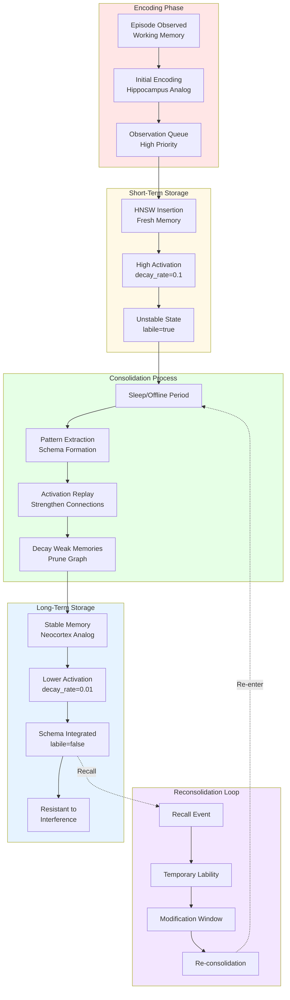

# Memory Consolidation Pipeline

## Mermaid Diagram



## ASCII Diagram

```
MEMORY CONSOLIDATION PIPELINE
═════════════════════════════

PHASE 1: ENCODING
┌────────────────────────────────────────────────────────────────┐
│  Input: Episode observed                                       │
│  ├─ sensory_data: "Saw doctor at hospital"                     │
│  ├─ context: {location, time, emotion}                         │
│  └─ embedding: [0.12, -0.45, ..., 0.23] (768-dim)             │
│                                                                 │
│  ↓ Working Memory (milliseconds)                               │
│                                                                 │
│  Initial Encoding:                                              │
│  ├─ activation: 1.0 (maximum)                                  │
│  ├─ confidence: 0.5 (tentative)                                │
│  ├─ state: FRESH                                               │
│  └─ decay_rate: 0.5 (rapid initial forgetting)                 │
│                                                                 │
│  ↓ Enqueue for processing                                      │
│                                                                 │
│  Observation Queue:                                             │
│  ├─ priority: HIGH (fresh memories prioritized)                │
│  ├─ batch_size: 10 (quick insertion)                           │
│  └─ latency: P99 < 10ms                                        │
└────────────────────────────────────────────────────────────────┘
                          ↓
PHASE 2: SHORT-TERM STORAGE
┌────────────────────────────────────────────────────────────────┐
│  HNSW Graph Insertion (hippocampus analog):                    │
│  ├─ Find similar memories via vector search                    │
│  ├─ Create node with high activation                           │
│  ├─ Link to semantic neighbors                                 │
│  └─ Mark as labile (modifiable)                                │
│                                                                 │
│  Memory State (T+0 to T+24h):                                  │
│  ┌──────────────────────────────────────────────────────────┐ │
│  │ Episode: "Saw doctor at hospital"                        │ │
│  │ ├─ activation: 1.0 → 0.7 → 0.5 (decaying)                │ │
│  │ ├─ confidence: 0.5 → 0.6 → 0.7 (increasing)              │ │
│  │ ├─ state: LABILE                                         │ │
│  │ ├─ decay_rate: 0.1 (moderate)                            │ │
│  │ ├─ neighbors: [doctor, hospital, health, ...]            │ │
│  │ └─ recall_count: 0 → 1 → 3 (tracking access)             │ │
│  └──────────────────────────────────────────────────────────┘ │
│                                                                 │
│  Activation Decay (first 24 hours):                             │
│    1.0 │ ████                                                   │
│    0.8 │     ████                                               │
│    0.6 │         ████                                           │
│    0.4 │             ████                                       │
│    0.2 │                 ████                                   │
│    0.0 └─────┬─────┬─────┬─────┬─────                          │
│              0h    6h   12h   18h   24h                         │
│                                                                 │
│  Vulnerability:                                                 │
│  ├─ Interference: HIGH (easily disrupted)                      │
│  ├─ Modification: EASY (labile state)                          │
│  └─ Forgetting: RAPID (high decay rate)                        │
└────────────────────────────────────────────────────────────────┘
                          ↓
PHASE 3: CONSOLIDATION
┌────────────────────────────────────────────────────────────────┐
│  Trigger: 24h since encoding OR sleep cycle                    │
│                                                                 │
│  Step 1: Pattern Extraction                                    │
│  ┌──────────────────────────────────────────────────────────┐ │
│  │ Analyze memory context and neighbors                     │ │
│  │ ├─ Find recurring patterns:                              │ │
│  │ │   [doctor, hospital] appears in 15 memories            │ │
│  │ ├─ Extract schema: "Medical Visit"                       │ │
│  │ └─ Generalize: doctor + hospital → healthcare context    │ │
│  └──────────────────────────────────────────────────────────┘ │
│                                                                 │
│  Step 2: Activation Replay                                     │
│  ┌──────────────────────────────────────────────────────────┐ │
│  │ Simulate recall paths to strengthen connections          │ │
│  │ ├─ Replay 1: doctor → hospital (strengthen +0.1)         │ │
│  │ ├─ Replay 2: hospital → doctor (strengthen +0.1)         │ │
│  │ ├─ Replay 3: health → hospital (strengthen +0.05)        │ │
│  │ └─ Result: Bidirectional strengthening                   │ │
│  └──────────────────────────────────────────────────────────┘ │
│                                                                 │
│  Step 3: Pruning                                               │
│  ┌──────────────────────────────────────────────────────────┐ │
│  │ Remove weak or redundant connections                      │ │
│  │ ├─ Threshold: activation < 0.2 after 7 days              │ │
│  │ ├─ Prune: "saw" → "at" (generic, low activation)         │ │
│  │ ├─ Keep: "doctor" → "hospital" (strong, specific)        │ │
│  │ └─ Result: 30% edge reduction, better signal/noise       │ │
│  └──────────────────────────────────────────────────────────┘ │
│                                                                 │
│  Step 4: State Transition                                      │
│  ┌──────────────────────────────────────────────────────────┐ │
│  │ Update memory metadata                                    │ │
│  │ ├─ state: LABILE → CONSOLIDATED                          │ │
│  │ ├─ decay_rate: 0.1 → 0.01 (10x slower forgetting)        │ │
│  │ ├─ confidence: 0.7 → 0.85 (increased certainty)          │ │
│  │ └─ schema: null → "Medical Visit"                        │ │
│  └──────────────────────────────────────────────────────────┘ │
│                                                                 │
│  Consolidation Timeline:                                        │
│    State                                                        │
│    LABILE    │████████████████│                                │
│    TRANSITION│                │████│                           │
│    CONSOLIDATED                     │████████████████          │
│    ─────────┴────────┴────────┴────────┴────────               │
│             0h      24h      48h      72h     →                │
└────────────────────────────────────────────────────────────────┘
                          ↓
PHASE 4: LONG-TERM STORAGE
┌────────────────────────────────────────────────────────────────┐
│  Memory State (T+72h onwards):                                 │
│  ┌──────────────────────────────────────────────────────────┐ │
│  │ Episode: "Saw doctor at hospital"                        │ │
│  │ ├─ activation: 0.3 (stable, low baseline)                │ │
│  │ ├─ confidence: 0.85 (high certainty)                     │ │
│  │ ├─ state: CONSOLIDATED                                   │ │
│  │ ├─ decay_rate: 0.01 (very slow forgetting)               │ │
│  │ ├─ schema: "Medical Visit"                               │ │
│  │ ├─ neighbors: [doctor, hospital] (pruned to essential)   │ │
│  │ └─ recall_count: 10 (strengthened by access)             │ │
│  └──────────────────────────────────────────────────────────┘ │
│                                                                 │
│  Characteristics:                                               │
│  ├─ Stable: Resistant to interference                          │
│  ├─ Gist: Retains meaning, loses details                       │
│  ├─ Schema: Integrated into "Medical Visit" pattern            │
│  └─ Retrievable: Via semantic cues (doctor, hospital, health)  │
│                                                                 │
│  Forgetting Curve (logarithmic):                                │
│    Activation                                                   │
│    1.0 │                                                        │
│    0.8 │ ╲                                                      │
│    0.6 │  ╲___                                                  │
│    0.4 │      ╲___                                              │
│    0.2 │          ╲___________                                  │
│    0.0 └────┬────┬────┬────┬────┬────                          │
│             0d   7d  30d  90d 180d 365d                         │
│                                                                 │
│  Formula: activation = base × e^(-decay_rate × time)            │
│           0.3 × e^(-0.01 × 365) = 0.3 × 0.026 = 0.008           │
└────────────────────────────────────────────────────────────────┘
                          ↓
PHASE 5: RECONSOLIDATION (on recall)
┌────────────────────────────────────────────────────────────────┐
│  Trigger: Memory recalled after consolidation                  │
│                                                                 │
│  T+0h: Recall Event                                            │
│  ┌──────────────────────────────────────────────────────────┐ │
│  │ User queries: "Tell me about my hospital visit"          │ │
│  │ ├─ HNSW search: Find consolidated memory                 │ │
│  │ ├─ Activation: 0.3 → 1.0 (spike on recall)               │ │
│  │ ├─ State: CONSOLIDATED → LABILE                          │ │
│  │ └─ Window: Opens for 1-6 hours                           │ │
│  └──────────────────────────────────────────────────────────┘ │
│                                                                 │
│  T+1h to T+6h: Modification Window                             │
│  ┌──────────────────────────────────────────────────────────┐ │
│  │ Memory is temporarily labile                             │ │
│  │ ├─ User provides correction: "It was a clinic, not hospital"│
│  │ ├─ Plasticity: 0.8 (high at T+3h peak)                   │ │
│  │ ├─ Update: hospital → clinic (modification accepted)     │ │
│  │ └─ New confidence: 0.9 (strengthened by correction)      │ │
│  └──────────────────────────────────────────────────────────┘ │
│                                                                 │
│  T+6h: Re-consolidation                                        │
│  ┌──────────────────────────────────────────────────────────┐ │
│  │ Window closes, memory re-stabilizes                      │ │
│  │ ├─ State: LABILE → CONSOLIDATED                          │ │
│  │ ├─ Re-enter consolidation pipeline (repeat Phase 3)      │ │
│  │ ├─ New schema: "Medical Visit" → "Clinic Visit"          │ │
│  │ └─ Permanent update stored                               │ │
│  └──────────────────────────────────────────────────────────┘ │
│                                                                 │
│  Plasticity During Reconsolidation:                             │
│    1.0 │          ╱────╲                                       │
│    0.8 │         ╱      ╲                                      │
│    0.6 │        ╱        ╲                                     │
│    0.4 │       ╱          ╲                                    │
│    0.2 │      ╱            ╲                                   │
│    0.0 └─────╱              ╲─────                             │
│         0h   1h    3h    6h   24h                              │
│         Recall     Peak      Re-stabilize                      │
└────────────────────────────────────────────────────────────────┘
```

## Consolidation Algorithm

```
CONSOLIDATION PSEUDOCODE
════════════════════════

function consolidate_memory(episode: Episode) -> ConsolidatedMemory:
    // Phase 1: Check eligibility
    if episode.age < 24 hours:
        return SKIP  // Too fresh

    if episode.state == CONSOLIDATED:
        return SKIP  // Already consolidated

    if episode.recall_count < 2:
        return SKIP  // Not accessed enough

    // Phase 2: Pattern extraction
    patterns = extract_patterns(episode)
    schema = find_or_create_schema(patterns)

    // Phase 3: Activation replay
    for i in 0..10:  // 10 replay iterations
        paths = sample_recall_paths(episode, k=5)
        for path in paths:
            strengthen_connections(path, boost=0.1)

    // Phase 4: Pruning
    for edge in episode.neighbors:
        if edge.activation < 0.2:
            prune_edge(edge)

    // Phase 5: State transition
    episode.state = CONSOLIDATED
    episode.decay_rate = 0.01  // 10x slower
    episode.confidence *= 1.2  // Increase certainty
    episode.schema = schema

    return episode
```

## Biological Analogy

```
┌────────────────────────────────────────────────────────────────┐
│           BRAIN REGIONS vs ENGRAM COMPONENTS                   │
│                                                                 │
│  Biological System          Engram Implementation              │
│  ──────────────────         ──────────────────────             │
│                                                                 │
│  HIPPOCAMPUS                HNSW GRAPH (Short-Term)            │
│  ├─ Rapid encoding          ├─ Fast insertion                 │
│  ├─ High plasticity         ├─ Labile state                   │
│  ├─ Temporary storage       ├─ High decay rate                │
│  └─ Pattern separation      └─ Neighbor linking                │
│                                                                 │
│  NEOCORTEX                  CONSOLIDATED STATE (Long-Term)     │
│  ├─ Slow learning           ├─ Multi-day consolidation        │
│  ├─ Schema formation        ├─ Pattern extraction             │
│  ├─ Stable storage          ├─ Low decay rate                 │
│  └─ Semantic integration    └─ Schema assignment               │
│                                                                 │
│  SLEEP CONSOLIDATION        OFFLINE PROCESSING                 │
│  ├─ Memory replay           ├─ Activation replay               │
│  ├─ Synaptic pruning        ├─ Edge pruning                   │
│  ├─ Pattern extraction      ├─ Schema extraction               │
│  └─ Transfer to cortex      └─ State transition                │
│                                                                 │
│  PROTEIN SYNTHESIS          PLASTICITY WINDOW                  │
│  ├─ 1-6 hour window         ├─ Reconsolidation window         │
│  ├─ Inverted-U kinetics     ├─ Inverted-U plasticity          │
│  ├─ Peak at 3-4h            ├─ Peak at 3-4h                   │
│  └─ Memory modification     └─ Episode modification            │
│                                                                 │
└────────────────────────────────────────────────────────────────┘
```

## Metrics and Monitoring

```
CONSOLIDATION METRICS
═════════════════════

1. CONSOLIDATION RATE
   ├─ memories_consolidated_per_day: Gauge
   ├─ consolidation_queue_depth: Gauge
   └─ consolidation_latency_ms: Histogram

2. PATTERN EXTRACTION
   ├─ schemas_created_total: Counter
   ├─ patterns_per_schema: Histogram
   └─ schema_assignment_rate: Gauge

3. PRUNING EFFICIENCY
   ├─ edges_pruned_total: Counter
   ├─ edges_pruned_percentage: Gauge
   └─ graph_density: Gauge (edges / nodes)

4. STATE TRANSITIONS
   ├─ labile_to_consolidated_total: Counter
   ├─ consolidated_to_labile_total: Counter (reconsolidation)
   └─ consolidation_failures_total: Counter

5. QUALITY METRICS
   ├─ confidence_increase: Histogram (before/after)
   ├─ recall_accuracy: Gauge (validates consolidation quality)
   └─ schema_coherence: Gauge (semantic similarity within schema)

EXAMPLE PROMETHEUS QUERIES
──────────────────────────

// Consolidation throughput (memories/day)
rate(memories_consolidated_total[24h]) * 86400

// Average confidence increase
avg(confidence_after_consolidation - confidence_before_consolidation)

// Pruning effectiveness (edges removed / total edges)
rate(edges_pruned_total[24h]) /
  (rate(edges_pruned_total[24h]) + edges_kept_total)

// Consolidation lag (time since eligible)
histogram_quantile(0.99, consolidation_queue_wait_time_ms)
```

## Performance Characteristics

```
┌────────────────────────────────────────────────────────────────┐
│                  CONSOLIDATION PERFORMANCE                     │
│                                                                 │
│  Phase                │ Latency  │ Throughput │ Memory        │
│  ────────────────────┼──────────┼────────────┼───────────    │
│  Pattern Extraction  │ 50ms     │ 100/sec    │ 10MB temp     │
│  Activation Replay   │ 200ms    │ 50/sec     │ 5MB temp      │
│  Pruning             │ 100ms    │ 100/sec    │ Frees 30%     │
│  State Transition    │ 10ms     │ 1000/sec   │ Negligible    │
│  ────────────────────┼──────────┼────────────┼───────────    │
│  Total per Memory    │ 360ms    │ ~3/sec     │ 15MB peak     │
│                                                                 │
│  Batch Consolidation (100 memories):                           │
│  ├─ Sequential: 360ms × 100 = 36 seconds                       │
│  ├─ Parallel (8 workers): 36s / 8 = 4.5 seconds                │
│  └─ Throughput: 100 / 4.5s = 22 memories/sec                   │
│                                                                 │
└────────────────────────────────────────────────────────────────┘

┌────────────────────────────────────────────────────────────────┐
│                     DECAY RATE COMPARISON                      │
│                                                                 │
│  State        │ Decay Rate │ Half-Life │ 90% Retention        │
│  ────────────┼────────────┼───────────┼────────────────      │
│  FRESH       │ 0.5        │ 1.4 days  │ 4.6 days             │
│  LABILE      │ 0.1        │ 6.9 days  │ 23 days              │
│  CONSOLIDATED│ 0.01       │ 69 days   │ 230 days (~8 months) │
│  ────────────┴────────────┴───────────┴────────────────      │
│                                                                 │
│  Formula: half_life = ln(2) / decay_rate                       │
│           90% retention = ln(10) / decay_rate                  │
│                                                                 │
└────────────────────────────────────────────────────────────────┘
```
