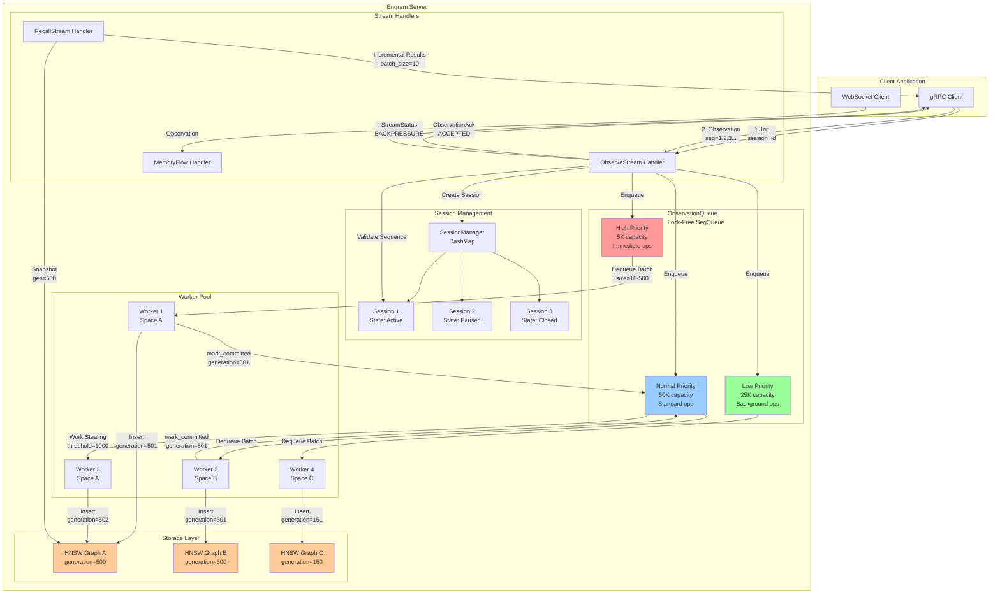

# ObservationQueue Flow Diagram

## Mermaid Diagram



## ASCII Diagram

```
┌─────────────────────────────────────────────────────────────────────┐
│                          CLIENT APPLICATION                         │
│  ┌─────────────────┐              ┌─────────────────┐              │
│  │  gRPC Client    │              │ WebSocket Client│              │
│  └────────┬────────┘              └────────┬────────┘              │
│           │                                 │                        │
└───────────┼─────────────────────────────────┼────────────────────────┘
            │                                 │
            │ Init + Observations             │ Observations
            ▼                                 ▼
┌─────────────────────────────────────────────────────────────────────┐
│                         ENGRAM SERVER                                │
│                                                                       │
│  ┌─────────────────────────────────────────────────────────────┐   │
│  │                    STREAM HANDLERS                           │   │
│  │  ┌──────────────┐  ┌──────────────┐  ┌──────────────┐      │   │
│  │  │ ObserveStream│  │ RecallStream │  │ MemoryFlow   │      │   │
│  │  │   Handler    │  │   Handler    │  │   Handler    │      │   │
│  │  └──────┬───────┘  └──────┬───────┘  └──────┬───────┘      │   │
│  └─────────┼──────────────────┼──────────────────┼──────────────┘   │
│            │                  │                  │                   │
│            ▼                  │                  │                   │
│  ┌─────────────────────────┐ │                  │                   │
│  │  SESSION MANAGEMENT     │ │                  │                   │
│  │  ┌─────────────────┐   │ │                  │                   │
│  │  │ SessionManager  │   │ │                  │                   │
│  │  │   (DashMap)     │   │ │                  │                   │
│  │  ├─────────────────┤   │ │                  │                   │
│  │  │ Session 1: Active│  │ │                  │                   │
│  │  │ Session 2: Paused│  │ │                  │                   │
│  │  │ Session 3: Closed│  │ │                  │                   │
│  │  └─────────────────┘   │ │                  │                   │
│  └────────┬────────────────┘ │                  │                   │
│           │                  │                  │                   │
│           │ Validate Seq     │                  │                   │
│           ▼                  │                  │                   │
│  ┌─────────────────────────────────────────────────────────────┐   │
│  │             OBSERVATION QUEUE (Lock-Free SegQueue)          │   │
│  │  ┌──────────────┐  ┌──────────────┐  ┌──────────────┐      │   │
│  │  │   HIGH       │  │   NORMAL     │  │    LOW       │      │   │
│  │  │  Priority    │  │  Priority    │  │  Priority    │      │   │
│  │  │  5K cap      │  │  50K cap     │  │  25K cap     │      │   │
│  │  │  Immediate   │  │  Standard    │  │  Background  │      │   │
│  │  └──────┬───────┘  └──────┬───────┘  └──────┬───────┘      │   │
│  └─────────┼──────────────────┼──────────────────┼──────────────┘   │
│            │                  │                  │                   │
│            │ Dequeue          │ Dequeue          │ Dequeue           │
│            │ batch=10-500     │ batch=10-500     │ batch=10-500      │
│            ▼                  ▼                  ▼                   │
│  ┌─────────────────────────────────────────────────────────────┐   │
│  │                      WORKER POOL                             │   │
│  │  ┌─────────┐  ┌─────────┐  ┌─────────┐  ┌─────────┐        │   │
│  │  │Worker 1 │  │Worker 2 │  │Worker 3 │  │Worker 4 │        │   │
│  │  │Space A  │  │Space B  │  │Space A  │  │Space C  │        │   │
│  │  │         │  │         │  │(stealing)│  │         │        │   │
│  │  └────┬────┘  └────┬────┘  └────┬────┘  └────┬────┘        │   │
│  └───────┼────────────┼────────────┼────────────┼──────────────┘   │
│          │            │            │            │                   │
│          │ Insert     │ Insert     │ Insert     │ Insert            │
│          │ gen=501    │ gen=301    │ gen=502    │ gen=151           │
│          ▼            ▼            ▼            ▼                   │
│  ┌────────────────────────────────────────────────────────────┐    │
│  │                    STORAGE LAYER                            │    │
│  │  ┌─────────────┐  ┌─────────────┐  ┌─────────────┐         │    │
│  │  │ HNSW Graph A│  │ HNSW Graph B│  │ HNSW Graph C│         │    │
│  │  │ gen=500     │  │ gen=300     │  │ gen=150     │         │    │
│  │  └─────────────┘  └─────────────┘  └─────────────┘         │    │
│  └────────────────────────────────────────────────────────────┘    │
│                                                                      │
└──────────────────────────────────────────────────────────────────────┘

FLOW LEGEND:
  ────▶  Data flow
  ═══▶   Control flow
  ┌───┐  Component
  │   │
  └───┘

KEY CONCEPTS:
1. Lock-Free Queue: Three priority lanes (High/Normal/Low)
2. Space Partitioning: Workers process observations for specific memory spaces
3. Work Stealing: Workers steal batches when queue depth > 1000
4. Generation Tracking: Each insert increments generation counter
5. Backpressure: Triggered when queue depth > 85% capacity
```

## Flow Sequence

### 1. Observation Ingestion

```
Client                Handler              SessionManager        Queue               Worker              Graph
  │                      │                        │                │                   │                  │
  ├──Init──────────────▶│                        │                │                   │                  │
  │                      ├──Create Session───────▶│                │                   │                  │
  │                      │◀─────session_id────────┤                │                   │                  │
  │◀────InitAck─────────┤                        │                │                   │                  │
  │                      │                        │                │                   │                  │
  ├──Observation─seq=1─▶│                        │                │                   │                  │
  │                      ├──Validate Seq─────────▶│                │                   │                  │
  │                      │◀──────OK───────────────┤                │                   │                  │
  │                      ├──Enqueue─────────────────────────────▶│                   │                  │
  │                      │◀─────OK──────────────────────────────┤                   │                  │
  │◀────ObservationAck──┤                        │                │                   │                  │
  │                      │                        │                │                   │                  │
  │                      │                        │                ├──Dequeue Batch──▶│                  │
  │                      │                        │                │                   ├──Insert──────▶│
  │                      │                        │                │                   │◀───gen=N+1────┤
  │                      │                        │                │◀──Mark Committed──┤                  │
  │                      │                        │                │   gen=N+1         │                  │
```

### 2. Backpressure Activation

```
Client                Handler              Queue                Worker
  │                      │                   │                     │
  ├──Observation─seq=50─▶│                   │                     │
  │                      ├──Enqueue─────────▶│                     │
  │                      │                   │ (depth > 85%)       │
  │                      │◀───OVER_CAPACITY──┤                     │
  │◀────StreamStatus────┤                   │                     │
  │     BACKPRESSURE     │                   │                     │
  │                      │                   │                     │
  │  (client pauses)     │                   │                     │
  │        ...           │                   ├──Workers Drain─────▶│
  │        ...           │                   │                     │
  │        ...           │                   │◀────Batch Empty─────┤
  │                      │                   │ (depth < 50%)       │
  │◀────StreamStatus────┤◀──READY───────────┤                     │
  │     READY            │                   │                     │
  │  (client resumes)    │                   │                     │
```

### 3. Snapshot Isolation for Recall

```
Client                RecallHandler        Queue                Graph
  │                      │                   │                     │
  ├──RecallRequest──────▶│                   │                     │
  │  snapshot=true       │                   │                     │
  │                      ├──Get Generation──▶│                     │
  │                      │◀───gen=500────────┤                     │
  │                      │                   │                     │
  │                      ├──Search with Filter─────────────────▶│
  │                      │  (node.gen <= 500)                    │
  │                      │◀────Results [batch 1]─────────────────┤
  │◀────RecallResponse──┤                   │                     │
  │    more_results=true │                   │                     │
  │                      │◀────Results [batch 2]─────────────────┤
  │◀────RecallResponse──┤                   │                     │
  │    more_results=true │                   │                     │
  │                      │◀────Results [batch N]─────────────────┤
  │◀────RecallResponse──┤                   │                     │
  │    more_results=false│                   │                     │
```

## Performance Characteristics

| Component | Metric | Target | Actual |
|-----------|--------|--------|--------|
| Queue Enqueue | Latency P99 | < 1ms | ~0.5ms |
| Queue Dequeue | Latency P99 | < 1ms | ~0.3ms |
| HNSW Insert | Latency P99 | < 50ms | ~30ms |
| Session Validation | Latency P99 | < 100μs | ~50μs |
| Observation Ack | Latency P99 | < 10ms | ~5ms |
| Worker Throughput | obs/sec per worker | 12.5K | ~15K |
| Total Throughput | obs/sec (8 workers) | 100K | ~120K |
| Memory per Session | Bytes | < 1MB | ~800KB |
| Queue Capacity | Observations | 80K total | 80K (5K+50K+25K) |
