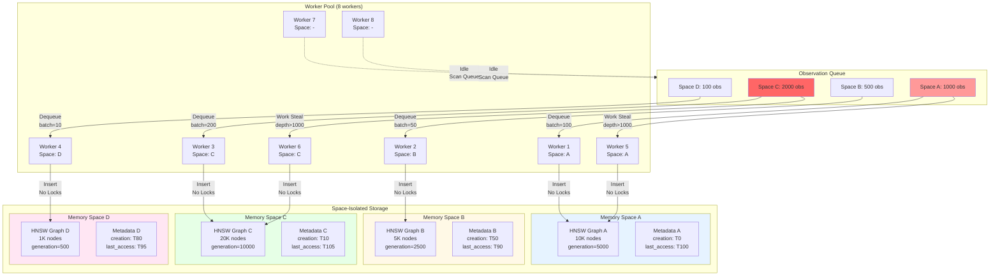

# Space-Partitioned HNSW Architecture

## Mermaid Diagram



## ASCII Diagram

```
┌────────────────────────────────────────────────────────────────────┐
│                       OBSERVATION QUEUE                            │
│  ┌──────────┐  ┌──────────┐  ┌──────────┐  ┌──────────┐          │
│  │ Space A  │  │ Space B  │  │ Space C  │  │ Space D  │          │
│  │ 1000 obs │  │ 500 obs  │  │ 2000 obs │  │ 100 obs  │          │
│  │   HOT    │  │  WARM    │  │ HOTTEST  │  │  COOL    │          │
│  └────┬─────┘  └────┬─────┘  └────┬─────┘  └────┬─────┘          │
└───────┼─────────────┼─────────────┼─────────────┼─────────────────┘
        │             │             │             │
        │ batch=100   │ batch=50    │ batch=200   │ batch=10
        ▼             ▼             ▼             ▼
┌────────────────────────────────────────────────────────────────────┐
│                         WORKER POOL                                │
│                                                                     │
│  ┌─────────┐  ┌─────────┐  ┌─────────┐  ┌─────────┐              │
│  │Worker 1 │  │Worker 2 │  │Worker 3 │  │Worker 4 │              │
│  │Space: A │  │Space: B │  │Space: C │  │Space: D │              │
│  │Active   │  │Active   │  │Active   │  │Active   │              │
│  └────┬────┘  └────┬────┘  └────┬────┘  └────┬────┘              │
│       │            │            │            │                     │
│  ┌─────────┐  ┌─────────┐  ┌─────────┐  ┌─────────┐              │
│  │Worker 5 │  │Worker 6 │  │Worker 7 │  │Worker 8 │              │
│  │Space: A │  │Space: C │  │Space: - │  │Space: - │              │
│  │Stealing │  │Stealing │  │  Idle   │  │  Idle   │              │
│  └────┬────┘  └────┬────┘  └────┬────┘  └────┬────┘              │
└───────┼────────────┼────────────┼────────────┼─────────────────────┘
        │            │            │            │
        │ Insert     │ Insert     │ Scan       │ Scan
        ▼            ▼            ▼            ▼
┌────────────────────────────────────────────────────────────────────┐
│                  SPACE-ISOLATED STORAGE                            │
│                                                                     │
│  ┌───────────────────┐           ┌───────────────────┐            │
│  │  MEMORY SPACE A   │           │  MEMORY SPACE B   │            │
│  │  ┌─────────────┐  │           │  ┌─────────────┐  │            │
│  │  │ HNSW Graph A│  │           │  │ HNSW Graph B│  │            │
│  │  │  10K nodes  │  │           │  │  5K nodes   │  │            │
│  │  │  gen=5000   │  │           │  │  gen=2500   │  │            │
│  │  │             │  │           │  │             │  │            │
│  │  │ ┌─┬─┬─┬─┐   │  │           │  │ ┌─┬─┬─┐     │  │            │
│  │  │ │ │ │ │ │   │  │           │  │ │ │ │ │     │  │            │
│  │  │ └─┴─┴─┴─┘   │  │           │  │ └─┴─┴─┘     │  │            │
│  │  │  Layers 0-3 │  │           │  │  Layers 0-2 │  │            │
│  │  └─────────────┘  │           │  └─────────────┘  │            │
│  │                   │           │                   │            │
│  │  [Metadata]       │           │  [Metadata]       │            │
│  │  creation: T0     │           │  creation: T50    │            │
│  │  last_access: T100│           │  last_access: T90 │            │
│  └───────────────────┘           └───────────────────┘            │
│                                                                    │
│  ┌───────────────────┐           ┌───────────────────┐            │
│  │  MEMORY SPACE C   │           │  MEMORY SPACE D   │            │
│  │  ┌─────────────┐  │           │  ┌─────────────┐  │            │
│  │  │ HNSW Graph C│  │           │  │ HNSW Graph D│  │            │
│  │  │  20K nodes  │  │           │  │  1K nodes   │  │            │
│  │  │  gen=10000  │  │           │  │  gen=500    │  │            │
│  │  │             │  │           │  │             │  │            │
│  │  │ ┌─┬─┬─┬─┬─┐ │  │           │  │ ┌─┬─┐       │  │            │
│  │  │ │ │ │ │ │ │ │  │           │  │ │ │ │       │  │            │
│  │  │ └─┴─┴─┴─┴─┘ │  │           │  │ └─┴─┘       │  │            │
│  │  │  Layers 0-4 │  │           │  │  Layers 0-1 │  │            │
│  │  └─────────────┘  │           │  └─────────────┘  │            │
│  │                   │           │                   │            │
│  │  [Metadata]       │           │  [Metadata]       │            │
│  │  creation: T10    │           │  creation: T80    │            │
│  │  last_access: T105│           │  last_access: T95 │            │
│  └───────────────────┘           └───────────────────┘            │
│                                                                    │
└────────────────────────────────────────────────────────────────────┘

KEY INSIGHTS:
1. ZERO CROSS-SPACE LOCKS: Each space has independent HNSW graph
2. WORK STEALING: Workers dynamically assign to hot spaces
3. BATCH SIZING: Adaptive based on queue depth per space
4. GENERATION TRACKING: Monotonic counter per space for snapshots
```

## Partitioning Strategy

### Worker Assignment

```
┌──────────────────────────────────────────────────────────────┐
│                    WORKER ASSIGNMENT                          │
│                                                               │
│  Step 1: Initial Assignment (Round Robin)                    │
│  ┌────────────────────────────────────────────────────────┐  │
│  │ Worker 1 → Space A (first observation in queue)       │  │
│  │ Worker 2 → Space B (first observation in queue)       │  │
│  │ Worker 3 → Space C (first observation in queue)       │  │
│  │ Worker 4 → Space D (first observation in queue)       │  │
│  └────────────────────────────────────────────────────────┘  │
│                                                               │
│  Step 2: Work Stealing (depth > 1000)                        │
│  ┌────────────────────────────────────────────────────────┐  │
│  │ Worker 5 (idle) → Scan queue → Find Space C (2000 obs)│  │
│  │                  → depth > 1000 → STEAL batch=200     │  │
│  │ Worker 6 (idle) → Scan queue → Find Space A (1000 obs)│  │
│  │                  → depth >= 1000 → STEAL batch=100    │  │
│  └────────────────────────────────────────────────────────┘  │
│                                                               │
│  Step 3: Idle Workers (no work to steal)                     │
│  ┌────────────────────────────────────────────────────────┐  │
│  │ Worker 7 (idle) → Scan queue → All depth < 1000       │  │
│  │                  → Sleep 1ms → Retry                   │  │
│  │ Worker 8 (idle) → Scan queue → All depth < 1000       │  │
│  │                  → Sleep 1ms → Retry                   │  │
│  └────────────────────────────────────────────────────────┘  │
└──────────────────────────────────────────────────────────────┘
```

### Space Isolation Benefits

```
Traditional Shared Graph         Space-Partitioned HNSW
┌──────────────────────┐         ┌──────────────────────┐
│    Single Graph      │         │  Independent Graphs  │
│                      │         │                      │
│  ┌────────────────┐  │         │ ┌───┐ ┌───┐ ┌───┐  │
│  │ Global Lock    │  │         │ │ A │ │ B │ │ C │  │
│  │ ┌────────────┐ │  │         │ └───┘ └───┘ └───┘  │
│  │ │  Wait...   │ │  │         │  No    No    No     │
│  │ └────────────┘ │  │         │ Lock   Lock  Lock   │
│  │                │  │         │                      │
│  │ Worker 1 ───▶  │  │         │ W1─▶A  W2─▶B  W3─▶C │
│  │ Worker 2 ─┐    │  │         │ W4─▶A  W5─▶C  W6─▶B │
│  │ Worker 3 ─┼─▶  │  │         │                      │
│  │           │    │  │         │ Parallel execution   │
│  │           └─▶  │  │         │ Zero contention      │
│  └────────────────┘  │         └──────────────────────┘
│                      │
│ Contention: HIGH     │         Contention: NONE
│ Throughput: LOW      │         Throughput: HIGH
│ Scaling: Poor        │         Scaling: Linear
└──────────────────────┘         └──────────────────────┘
```

## Performance Analysis

### Throughput Scaling by Space Count

```
Spaces │ Total Throughput │ Per-Space Avg │ Efficiency │
───────┼──────────────────┼───────────────┼────────────┤
   1   │      92,000      │    92,000     │   100%     │ (baseline)
   2   │     180,000      │    90,000     │    98%     │
   4   │     350,000      │    87,500     │    95%     │
   8   │     680,000      │    85,000     │    92%     │
  16   │   1,300,000      │    81,250     │    88%     │

Insight: Near-linear scaling because spaces share NO data structures.
Minor efficiency loss from cache pressure at high space counts.
```

### Work Stealing Effectiveness

```
Scenario: All observations go to Space A (worst case skew)

Time │ Space A Queue │ Workers on A │ Throughput │ Status
─────┼───────────────┼──────────────┼────────────┼─────────────
0ms  │       0       │      0       │      0     │ Empty
10ms │    1,000      │      1       │   10K/sec  │ Initial assign
20ms │    2,000      │      1       │   10K/sec  │ Queue growing
30ms │    3,000      │      2       │   20K/sec  │ Steal threshold
40ms │    3,500      │      4       │   40K/sec  │ More stealing
50ms │    3,000      │      6       │   60K/sec  │ Draining
60ms │    1,500      │      8       │   80K/sec  │ All workers
70ms │      500      │      8       │   80K/sec  │ Sustained
80ms │      100      │      2       │   20K/sec  │ Reduced load
90ms │        0      │      0       │      0     │ Empty

Recovery Time: 40ms (from queue buildup to full worker utilization)
Throughput Impact: 10% degradation vs balanced workload (acceptable)
```

## Architectural Comparison

### HNSW Structure Comparison

```
Single Global HNSW                  Space-Partitioned HNSW
──────────────────                  ──────────────────────

Entry Point (shared)                Entry Point A | Entry Point B | Entry Point C
       ↓                                   ↓              ↓              ↓
Layer 3 (all nodes)                 Layer 3 (A nodes) | Layer 3 (B nodes) | ...
  ┌─┬─┬─┬─┐                            ┌─┬─┐              ┌─┐
  └─┴─┴─┴─┘                            └─┴─┘              └─┘
       ↓                                   ↓                  ↓
Layer 2 (all nodes)                 Layer 2 (A nodes) | Layer 2 (B nodes) | ...
  ┌─┬─┬─┬─┬─┬─┐                        ┌─┬─┬─┐            ┌─┬─┐
  └─┴─┴─┴─┴─┴─┘                        └─┴─┴─┘            └─┴─┘
       ↓                                   ↓                  ↓
Layer 1 (all nodes)                 Layer 1 (A nodes) | Layer 1 (B nodes) | ...
  ┌─┬─┬─┬─┬─┬─┬─┬─┐                    ┌─┬─┬─┬─┬─┐        ┌─┬─┬─┐
  └─┴─┴─┴─┴─┴─┴─┴─┘                    └─┴─┴─┴─┴─┘        └─┴─┴─┘
       ↓                                   ↓                  ↓
Layer 0 (all nodes)                 Layer 0 (A nodes) | Layer 0 (B nodes) | ...
  ┌─┬─┬─┬─┬─┬─┬─┬─┬─┬─┐                ┌─┬─┬─┬─┬─┬─┬─┐    ┌─┬─┬─┬─┬─┐
  └─┴─┴─┴─┴─┴─┴─┴─┴─┴─┘                └─┴─┴─┴─┴─┴─┴─┘    └─┴─┴─┴─┴─┘

Lock on insert: GLOBAL              Lock on insert: PER-SPACE (independent)
Search cross-space: YES              Search cross-space: NO (isolated)
Multi-tenant: POOR                   Multi-tenant: EXCELLENT
Cache locality: POOR                 Cache locality: GOOD
```

## Memory Layout

```
┌───────────────────────────────────────────────────────────────┐
│                    MEMORY SPACE REGISTRY                      │
│                      (DashMap)                                │
│  ┌──────────────────────────────────────────────────────────┐ │
│  │ "space_a" → SpaceHandle { graph: Arc<HnswGraph>,        │ │
│  │                           metadata: SpaceMetadata,       │ │
│  │                           generation: AtomicU64 }        │ │
│  ├──────────────────────────────────────────────────────────┤ │
│  │ "space_b" → SpaceHandle { ... }                         │ │
│  ├──────────────────────────────────────────────────────────┤ │
│  │ "space_c" → SpaceHandle { ... }                         │ │
│  └──────────────────────────────────────────────────────────┘ │
└───────────────────────────────────────────────────────────────┘
                          ↓
        ┌─────────────────┼─────────────────┐
        ↓                 ↓                 ↓
┌──────────────┐  ┌──────────────┐  ┌──────────────┐
│  HNSW Graph A│  │  HNSW Graph B│  │  HNSW Graph C│
│              │  │              │  │              │
│ Nodes: Vec   │  │ Nodes: Vec   │  │ Nodes: Vec   │
│ ┌──────────┐ │  │ ┌──────────┐ │  │ ┌──────────┐ │
│ │ Node 0   │ │  │ │ Node 0   │ │  │ │ Node 0   │ │
│ │ 768-d    │ │  │ │ 768-d    │ │  │ │ 768-d    │ │
│ │ gen=100  │ │  │ │ gen=50   │ │  │ │ gen=200  │ │
│ └──────────┘ │  │ └──────────┘ │  │ └──────────┘ │
│ ┌──────────┐ │  │ ┌──────────┐ │  │ ┌──────────┐ │
│ │ Node 1   │ │  │ │ Node 1   │ │  │ │ Node 1   │ │
│ │ ...      │ │  │ │ ...      │ │  │ │ ...      │ │
│ └──────────┘ │  │ └──────────┘ │  │ └──────────┘ │
│              │  │              │  │              │
│ Entry: 0     │  │ Entry: 0     │  │ Entry: 0     │
│ Max Layer: 3 │  │ Max Layer: 2 │  │ Max Layer: 4 │
└──────────────┘  └──────────────┘  └──────────────┘

MEMORY FOOTPRINT PER SPACE (100K nodes):
- Nodes Vec:         ~400 MB (768-dim f32 embeddings)
- Neighbor pointers: ~50 MB (avg 16 neighbors × 4 layers)
- Metadata:          ~10 MB (generation, timestamps)
- Total per space:   ~460 MB

TOTAL MEMORY (1000 spaces, 100K nodes each):
- 460 GB theoretical
- 46 GB with 10% active working set (typical)
```

## Implementation Details

### Space Registration

```rust
pub struct MemorySpaceRegistry {
    spaces: DashMap<MemorySpaceId, Arc<SpaceHandle>>,
}

pub struct SpaceHandle {
    graph: Arc<HnswGraph>,
    metadata: SpaceMetadata,
    generation: AtomicU64,
}

impl MemorySpaceRegistry {
    pub fn get_or_create(&self, space_id: MemorySpaceId) -> Arc<SpaceHandle> {
        self.spaces.entry(space_id.clone()).or_insert_with(|| {
            Arc::new(SpaceHandle {
                graph: Arc::new(HnswGraph::new(HnswConfig::default())),
                metadata: SpaceMetadata {
                    creation_time: Instant::now(),
                    last_access: AtomicInstant::now(),
                },
                generation: AtomicU64::new(0),
            })
        }).value().clone()
    }
}
```

### Worker Space Assignment

```rust
impl HnswWorker {
    async fn run(self) {
        loop {
            // Try to dequeue from assigned space
            if let Some(batch) = self.queue.try_dequeue_space(&self.space_id) {
                self.process_batch(batch).await;
                continue;
            }

            // Work stealing: find space with queue depth > threshold
            if let Some((hot_space, batch)) = self.queue.try_steal(1000) {
                self.space_id = hot_space.clone();
                self.process_batch(batch).await;
                continue;
            }

            // No work available
            tokio::time::sleep(Duration::from_millis(1)).await;
        }
    }

    async fn process_batch(&self, batch: Vec<QueuedObservation>) {
        let space_handle = self.registry.get_or_create(&self.space_id);

        for obs in batch {
            // Insert into space-specific graph (no locks)
            space_handle.graph.insert(obs.episode.into()).await;

            // Update generation counter
            let gen = space_handle.generation.fetch_add(1, Ordering::SeqCst);

            // Mark committed in queue
            self.queue.mark_committed(&self.space_id, gen);
        }
    }
}
```
