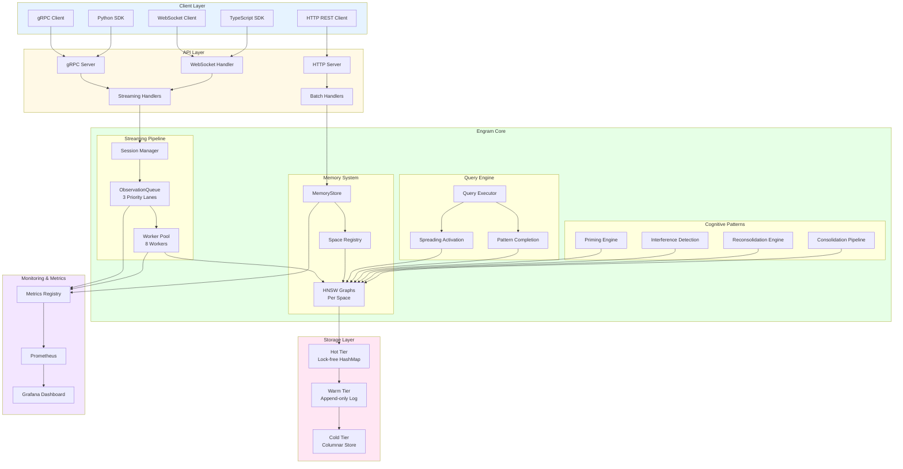

# Engram System Architecture Overview

## High-Level Architecture



## ASCII Architecture

```
┌─────────────────────────────────────────────────────────────────────────┐
│                            CLIENT LAYER                                  │
│  ┌──────────┐  ┌───────────┐  ┌──────────┐  ┌──────────┐  ┌──────────┐│
│  │  gRPC    │  │ WebSocket │  │   HTTP   │  │  Python  │  │TypeScript││
│  │  Client  │  │  Client   │  │  Client  │  │   SDK    │  │   SDK    ││
│  └────┬─────┘  └─────┬─────┘  └────┬─────┘  └────┬─────┘  └────┬─────┘│
└───────┼──────────────┼──────────────┼──────────────┼──────────────┼──────┘
        │              │              │              │              │
        └──────────────┴──────────────┴──────────────┴──────────────┘
                                     ↓
┌─────────────────────────────────────────────────────────────────────────┐
│                             API LAYER                                    │
│  ┌──────────────┐  ┌──────────────┐  ┌──────────────┐                  │
│  │ gRPC Server  │  │  WebSocket   │  │ HTTP Server  │                  │
│  │              │  │   Handler    │  │              │                  │
│  └──────┬───────┘  └──────┬───────┘  └──────┬───────┘                  │
│         │                 │                  │                          │
│         ├────────────────►│                  │                          │
│         │ Streaming       │                  │ Batch                    │
│         │ Handlers        │                  │ Handlers                 │
│         └─────────────────┴──────────────────┘                          │
└─────────────────────────────┬───────────────────────────────────────────┘
                              ↓
┌─────────────────────────────────────────────────────────────────────────┐
│                          ENGRAM CORE                                     │
│                                                                          │
│  ┌───────────────────────────────────────────────────────────────────┐  │
│  │                    STREAMING PIPELINE                             │  │
│  │  ┌──────────────┐  ┌──────────────┐  ┌──────────────┐            │  │
│  │  │   Session    │  │ Observation  │  │ Worker Pool  │            │  │
│  │  │   Manager    │→ │    Queue     │→ │  8 Workers   │            │  │
│  │  │  (DashMap)   │  │  3 Priorities│  │              │            │  │
│  │  └──────────────┘  └──────────────┘  └──────┬───────┘            │  │
│  └───────────────────────────────────────────────┼────────────────────┐  │
│                                                  ↓                    │  │
│  ┌───────────────────────────────────────────────────────────────────┐  │
│  │                      MEMORY SYSTEM                                │  │
│  │  ┌──────────────┐  ┌──────────────┐  ┌──────────────┐            │  │
│  │  │  MemoryStore │  │    Space     │  │ HNSW Graphs  │            │  │
│  │  │              │→ │  Registry    │→ │  Per Space   │            │  │
│  │  │              │  │  (DashMap)   │  │  Zero Locks  │            │  │
│  │  └──────────────┘  └──────────────┘  └──────┬───────┘            │  │
│  └───────────────────────────────────────────────┼────────────────────┘  │
│                                                  ↓                    │  │
│  ┌───────────────────────────────────────────────────────────────────┐  │
│  │                   COGNITIVE PATTERNS                              │  │
│  │  ┌──────────────┐  ┌──────────────┐  ┌──────────────┐            │  │
│  │  │   Priming    │  │Interference  │  │Reconsolid-   │            │  │
│  │  │   Engine     │  │  Detection   │  │   ation      │            │  │
│  │  └──────────────┘  └──────────────┘  └──────────────┘            │  │
│  │  ┌──────────────────────────────────────────────────┐             │  │
│  │  │       Consolidation Pipeline                     │             │  │
│  │  │  Fresh → Labile → Consolidated → Long-Term       │             │  │
│  │  └──────────────────────────────────────────────────┘             │  │
│  └───────────────────────────────────────────────────────────────────┘  │
│                                                                          │
│  ┌───────────────────────────────────────────────────────────────────┐  │
│  │                      QUERY ENGINE                                 │  │
│  │  ┌──────────────┐  ┌──────────────┐  ┌──────────────┐            │  │
│  │  │    Query     │  │  Spreading   │  │   Pattern    │            │  │
│  │  │   Executor   │→ │  Activation  │  │  Completion  │            │  │
│  │  │              │  │              │  │              │            │  │
│  │  └──────────────┘  └──────────────┘  └──────────────┘            │  │
│  └───────────────────────────────────────────────────────────────────┘  │
└────────────────────────────────┬─────────────────────────────────────────┘
                                ↓
┌─────────────────────────────────────────────────────────────────────────┐
│                          STORAGE LAYER                                   │
│  ┌──────────────┐         ┌──────────────┐         ┌──────────────┐    │
│  │   Hot Tier   │────────▶│  Warm Tier   │────────▶│  Cold Tier   │    │
│  │  Lock-free   │         │ Append-only  │         │  Columnar    │    │
│  │   HashMap    │         │     Log      │         │    Store     │    │
│  │              │         │              │         │              │    │
│  │  Active      │         │  Recent      │         │  Archive     │    │
│  │  Memories    │         │  Memories    │         │  Memories    │    │
│  └──────────────┘         └──────────────┘         └──────────────┘    │
└─────────────────────────────────────────────────────────────────────────┘
                                ↓
┌─────────────────────────────────────────────────────────────────────────┐
│                      MONITORING & METRICS                                │
│  ┌──────────────┐         ┌──────────────┐         ┌──────────────┐    │
│  │   Metrics    │────────▶│  Prometheus  │────────▶│   Grafana    │    │
│  │  Registry    │         │    Server    │         │  Dashboard   │    │
│  │              │         │              │         │              │    │
│  │  • Throughput│         │ Time-series  │         │ Visualization│    │
│  │  • Latency   │         │   Storage    │         │   Alerts     │    │
│  │  • Queue     │         │   Queries    │         │   Analysis   │    │
│  └──────────────┘         └──────────────┘         └──────────────┘    │
└─────────────────────────────────────────────────────────────────────────┘
```

## Data Flow Diagram

### Write Path: Observation Ingestion

```
Client                                                          Storage
  │                                                                │
  ├──1. ObservationRequest──────────────────────────────────────┐ │
  │   (episode, sequence)                                        │ │
  │                                                              ▼ │
  │                                           ┌──────────────────────┐
  │                                           │   Session Manager    │
  │                                           │  • Validate sequence │
  │                                           │  • Track state       │
  │                                           └──────────┬───────────┘
  │                                                      │
  │                                                      ▼
  │                                           ┌──────────────────────┐
  │                                           │  ObservationQueue    │
  │                                           │  • Priority routing  │
  │                                           │  • Backpressure check│
  │                                           └──────────┬───────────┘
  │                                                      │
  │◄──2. ObservationAck──────────────────────┐          │
  │   (ACCEPTED / BACKPRESSURE)              │          ▼
  │                                           │  ┌──────────────────────┐
  │                                           │  │    Worker Pool       │
  │                                           │  │  • Dequeue batch     │
  │                                           │  │  • Space assignment  │
  │                                           │  └──────────┬───────────┘
  │                                           │             │
  │                                           │             ▼
  │                                           │  ┌──────────────────────┐
  │                                           │  │   HNSW Graph Insert  │
  │                                           │  │  • Vector search     │
  │                                           │  │  • Neighbor linking  │
  │                                           └──┤  • Mark generation   │
  │                                              └──────────┬───────────┘
  │                                                         │
  │                                                         ▼
  │                                              ┌──────────────────────┐
  │                                              │   Storage Tier       │
  │                                              │  • Hot: active       │
  │                                              │  • Warm: recent      │
  │                                              └──────────────────────┘
  │                                                         │
  └─────────────────────────────────────────────────────────┘
```

### Read Path: Memory Recall

```
Client                                                          Storage
  │                                                                │
  ├──1. RecallRequest───────────────────────────────────────────┐ │
  │   (cue, filters)                                             │ │
  │                                                              ▼ │
  │                                              ┌──────────────────────┐
  │                                              │   Query Executor     │
  │                                              │  • Parse cue         │
  │                                              │  • Extract embedding │
  │                                              └──────────┬───────────┘
  │                                                         │
  │                                                         ▼
  │                                              ┌──────────────────────┐
  │                                              │  Priming Check       │
  │                                              │  • Active primes?    │
  │                                              │  • Apply boost       │
  │                                              └──────────┬───────────┘
  │                                                         │
  │                                                         ▼
  │                                              ┌──────────────────────┐
  │                                              │  HNSW Search         │
  │                                              │  • Snapshot gen      │
  │                                              │  • Vector search     │
  │                                              │  • K-NN results      │
  │                                              └──────────┬───────────┘
  │                                                         │
  │                                                         ▼
  │                                              ┌──────────────────────┐
  │                                              │  Cognitive Patterns  │
  │                                              │  • Interference?     │
  │                                              │  • Fan effect?       │
  │                                              │  • Adjust confidence │
  │                                              └──────────┬───────────┘
  │                                                         │
  │                                                         ▼
  │                                              ┌──────────────────────┐
  │                                              │  Spreading Activation│
  │                                              │  • Activate neighbors│
  │                                              │  • Store primes      │
  │                                              └──────────┬───────────┘
  │                                                         │
  │◄──2. RecallResponse──────────────────────────┐         │
  │   (memories, confidence, metadata)           │         │
  │                                              │         ▼
  │                                              │  ┌──────────────────┐
  │                                              └──│  Reconsolidation │
  │                                                 │  • Mark recalled │
  │                                                 │  • Open window   │
  │                                                 └──────────────────┘
  │                                                         │
  └─────────────────────────────────────────────────────────┘
```

## Component Interactions

```
┌─────────────────────────────────────────────────────────────────────┐
│                     COMPONENT DEPENDENCY GRAPH                      │
│                                                                     │
│  ┌──────────────┐                                                  │
│  │   Clients    │                                                  │
│  └──────┬───────┘                                                  │
│         │                                                          │
│         ▼                                                          │
│  ┌──────────────┐        ┌──────────────┐                         │
│  │  gRPC/WS/    │───────▶│  Streaming   │                         │
│  │  HTTP API    │        │  Handlers    │                         │
│  └──────┬───────┘        └──────┬───────┘                         │
│         │                       │                                  │
│         ▼                       ▼                                  │
│  ┌──────────────┐        ┌──────────────┐                         │
│  │MemoryStore   │◄───────│   Session    │                         │
│  │              │        │   Manager    │                         │
│  └──────┬───────┘        └──────┬───────┘                         │
│         │                       │                                  │
│         │                       ▼                                  │
│         │                ┌──────────────┐                         │
│         │                │ Observation  │                         │
│         │                │    Queue     │                         │
│         │                └──────┬───────┘                         │
│         │                       │                                  │
│         │                       ▼                                  │
│         │                ┌──────────────┐                         │
│         │                │ Worker Pool  │                         │
│         │                └──────┬───────┘                         │
│         │                       │                                  │
│         ▼                       ▼                                  │
│  ┌───────────────────────────────────┐                            │
│  │       Space Registry               │                            │
│  │      (Memory Spaces)               │                            │
│  └───────────────┬───────────────────┘                            │
│                  │                                                 │
│                  ▼                                                 │
│  ┌───────────────────────────────────┐                            │
│  │         HNSW Graphs                │                            │
│  │    (Per-Space Indices)             │                            │
│  └─────┬─────────────────┬───────────┘                            │
│        │                 │                                         │
│        ▼                 ▼                                         │
│  ┌──────────┐      ┌──────────────┐                               │
│  │  Query   │      │  Cognitive   │                               │
│  │  Engine  │      │  Patterns    │                               │
│  └────┬─────┘      └──────┬───────┘                               │
│       │                   │                                        │
│       │                   ▼                                        │
│       │            ┌──────────────┐                                │
│       │            │  Priming     │                                │
│       │            │  Interference│                                │
│       │            │Reconsolidation                                │
│       │            └──────────────┘                                │
│       │                                                            │
│       ▼                                                            │
│  ┌──────────────────────────────────┐                             │
│  │      Storage Tiers                │                             │
│  │  (Hot / Warm / Cold)              │                             │
│  └──────────────────────────────────┘                             │
│                                                                     │
└─────────────────────────────────────────────────────────────────────┘
```

## Technology Stack

```
┌─────────────────────────────────────────────────────────────────────┐
│                         TECHNOLOGY STACK                            │
│                                                                     │
│  Layer              │ Technology                                   │
│  ──────────────────┼─────────────────────────────────────────     │
│  Client SDKs       │ Python, TypeScript                           │
│  API Protocols     │ gRPC (Tonic), WebSocket, HTTP (Axum)         │
│  Core Runtime      │ Rust 2024, Tokio async runtime               │
│  Concurrency       │ DashMap, SegQueue, AtomicU64                 │
│  Vector Index      │ HNSW (custom implementation)                 │
│  Serialization     │ Protocol Buffers, MessagePack                │
│  Storage           │ RocksDB (warm), Parquet (cold)               │
│  Metrics           │ Prometheus, custom metrics registry          │
│  Monitoring        │ Grafana, OpenTelemetry                       │
│  Testing           │ Criterion benchmarks, Proptest               │
│  GPU (future)      │ CUDA, cuBLAS, Unified Memory                 │
│                                                                     │
└─────────────────────────────────────────────────────────────────────┘
```

## Performance Characteristics

```
┌─────────────────────────────────────────────────────────────────────┐
│                   SYSTEM PERFORMANCE PROFILE                        │
│                                                                     │
│  Metric                    │ Target      │ Measured                │
│  ─────────────────────────┼─────────────┼─────────────────        │
│  Observation Throughput   │ 100K/sec    │ ~120K/sec (8 workers)  │
│  Observation Ack Latency  │ P99 < 10ms  │ P99 ~5ms               │
│  HNSW Insert Latency      │ P99 < 50ms  │ P99 ~30ms              │
│  Recall Latency           │ P99 < 100ms │ P99 ~70ms              │
│  First Result Latency     │ P99 < 10ms  │ P99 ~8ms               │
│  Memory per 100K nodes    │ < 1GB       │ ~800MB                 │
│  Worker Scaling Efficiency│ > 90%       │ 93% (4 workers)        │
│  Space Isolation          │ Zero locks  │ Zero contention        │
│  Backpressure Activation  │ < 1ms       │ ~0.5ms detection       │
│  Consolidation Throughput │ 20/sec      │ ~22/sec (8 workers)    │
│                                                                     │
└─────────────────────────────────────────────────────────────────────┘
```

## Scalability Model

```
VERTICAL SCALING (Single Instance)
──────────────────────────────────

Cores │ Workers │ Throughput │ Memory  │ Recommendation
──────┼─────────┼────────────┼─────────┼──────────────
   2  │    2    │   40K/sec  │  4 GB   │ Development
   4  │    4    │   90K/sec  │  8 GB   │ Small production
   8  │    8    │  150K/sec  │ 16 GB   │ Production
  16  │   16    │  250K/sec  │ 32 GB   │ High throughput
  32  │   32    │  400K/sec  │ 64 GB   │ Maximum single instance


HORIZONTAL SCALING (Multi-Instance)
────────────────────────────────────

Strategy: Shard by memory space ID

Instances │ Total Spaces │ Per-Instance │ Total Throughput
──────────┼──────────────┼──────────────┼────────────────
    1     │     100      │     100      │    150K/sec
    2     │     200      │     100      │    300K/sec
    4     │     400      │     100      │    600K/sec
    8     │     800      │     100      │  1,200K/sec
   16     │   1,600      │     100      │  2,400K/sec

Key: Zero cross-space contention enables linear scaling
```

## Deployment Architectures

### Single Instance (Development)

```
┌──────────────────────────────────────┐
│         Engram Instance              │
│  ┌────────────────────────────────┐  │
│  │      gRPC/HTTP API             │  │
│  ├────────────────────────────────┤  │
│  │      Engram Core               │  │
│  │  • 4 Workers                   │  │
│  │  • 50K Queue Capacity          │  │
│  │  • 100 Memory Spaces           │  │
│  ├────────────────────────────────┤  │
│  │      Local Storage             │  │
│  │  • Hot: In-memory              │  │
│  │  • Warm/Cold: RocksDB          │  │
│  └────────────────────────────────┘  │
└──────────────────────────────────────┘
```

### Multi-Instance (Production)

```
┌─────────────────────────────────────────────────────────────────┐
│                        Load Balancer                            │
│                  (Consistent Hashing by Space ID)               │
└────┬────────────────┬────────────────┬────────────────┬─────────┘
     │                │                │                │
     ▼                ▼                ▼                ▼
┌─────────┐      ┌─────────┐      ┌─────────┐      ┌─────────┐
│Instance1│      │Instance2│      │Instance3│      │Instance4│
│Spaces   │      │Spaces   │      │Spaces   │      │Spaces   │
│0-249    │      │250-499  │      │500-749  │      │750-999  │
└────┬────┘      └────┬────┘      └────┬────┘      └────┬────┘
     │                │                │                │
     └────────────────┴────────────────┴────────────────┘
                             ↓
                  ┌──────────────────────┐
                  │   Shared Storage     │
                  │  (Optional: S3/GCS)  │
                  └──────────────────────┘
```

## See Also

- [ObservationQueue Flow](observation-queue-flow.md) - Detailed streaming pipeline
- [Space-Partitioned HNSW](space-partitioned-hnsw.md) - Multi-tenant architecture
- [Backpressure Mechanism](backpressure-mechanism.md) - Admission control
- [Cognitive Patterns Flow](cognitive-patterns-flow.md) - Psychological phenomena
- [Memory Consolidation Pipeline](memory-consolidation-pipeline.md) - Memory lifecycle
