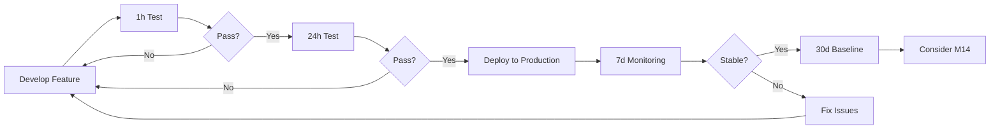

# Test Duration Matrix

**Purpose**: Define what gets tested at different time scales and why.

This document organizes all Engram validation tests by duration, showing what different time scales validate and when to run them.

---

## Duration Comparison

| Duration | Purpose | What's Different | When to Run | Validates |
|----------|---------|------------------|-------------|-----------|
| **1 hour** | Quick validation | Basic stability, no leak detection | Every PR, development | Functionality works |
| **24 hours** | Production gate | Memory leaks, cadence accuracy | Before prod deploy | Single-node production ready |
| **7 days** | Burn-in validation | Long-term trends, rare issues | After prod deploy | Production stability |
| **30 days** | Operational baseline | Real workload patterns, capacity | Quarterly | Capacity planning |

---

## 1-Hour Test

### Purpose
**Fast validation** that core functionality works without obvious issues.

### What It Tests
- ✓ Basic consolidation works (60 runs)
- ✓ No immediate crashes
- ✓ Performance within bounds
- ✓ Quick memory check (not leak detection)

### What It DOESN'T Test
- ✗ Memory leaks (too short to detect)
- ✗ Long-term performance degradation
- ✗ Rare timing issues
- ✗ Multi-day workload patterns

### Use Cases
- **Development iteration**: Fast feedback during feature work
- **Pull request validation**: Basic smoke test before merge
- **Quick test mode**: `./scripts/validate_24h_production.sh --quick-test`

### Acceptance Criteria
```
✓ Process completes without crash
✓ 60 consolidation runs successful
✓ Memory <200MB RSS
✓ All tests pass pre/post
```

### Output
```
/tmp/engram-1h/
├── consolidation.log
├── snapshots.jsonl (60 entries)
└── metrics.jsonl
```

---

## 24-Hour Test

### Purpose
**Production deployment gate** - validates single-node readiness.

### What It Tests
- ✓ Memory leak detection (<25% RSS growth)
- ✓ Consolidation cadence accuracy (1,440 runs, 95% within ±2s)
- ✓ Performance stability over day/night cycles
- ✓ Resource usage patterns
- ✓ Crash recovery (deliberate SIGKILL at hour 12)
- ✓ Multi-phase load patterns
- ✓ Cognitive pattern accuracy

### What It DOESN'T Test
- ✗ Week-long trends
- ✗ Real user behavior patterns
- ✗ Seasonal workload changes
- ✗ Rare edge cases (<1/day occurrence)

### Use Cases
- **Pre-production validation**: Required before deploying to production
- **M14 prerequisite**: Establishes single-node baselines
- **Release candidate validation**: Gate for major releases

### Acceptance Criteria
**CRITICAL (All 5 must pass)**:
```
✓ Zero crashes (except deliberate test crash)
✓ Zero memory leaks (RSS growth <25%)
✓ Zero data corruption
✓ Consolidation cadence stable (≥95% within 60s±2s)
✓ All tests passing pre and post
```

**HIGH (≥8/10 must pass)**:
```
✓ Spreading activation P99 <50ms
✓ Vector query P99 <2ms
✓ Throughput sustains 1K obs/sec
✓ CPU <80% sustained
✓ Disk growth <10GB
✓ Thread count stable
✓ FD count stable
✓ Backpressure working
✓ Metrics recording
✓ Evidence chains maintained
```

### Test Phases
1. **Baseline** (0-2h): Establish metrics
2. **Steady State** (2-8h): Sustained moderate load
3. **Burst** (8-9h): 10K obs/sec spike
4. **Recovery** (9-10h): Return to baseline
5. **Crash Injection** (12h): SIGKILL + recovery
6. **Multi-Tenant** (12-18h): 10 memory spaces
7. **Resource Pressure** (18-20h): Artificial limits
8. **Cognitive** (20-22h): Psychology validation
9. **Burn-in** (22-24h): Final sustained load
10. **Validation** (24h): Compare to baseline

### Output
```
/tmp/engram-24h/
├── VALIDATION_REPORT.md ⭐ (PASS/CONDITIONAL/FAIL)
├── validation.log
├── metrics.csv (1,440 samples)
├── consolidation/
│   ├── snapshots.jsonl (1,440 entries)
│   └── metrics.jsonl
├── tests_pre.log
├── tests_post.log
└── bench_during_soak.log
```

### Run Command
```bash
# Full 24-hour test (production validation)
./scripts/validate_24h_production.sh

# Quick 1-hour test (development)
./scripts/validate_24h_production.sh --quick-test
```

### Documentation
- Plan: `docs/operations/24-hour-validation-plan.md`
- Checklist: `docs/operations/24h-validation-checklist.md`
- Script: `scripts/validate_24h_production.sh`

---

## 7-Day Test

### Purpose
**Production burn-in** - validates system under real operational load.

### What It Tests
- ✓ Weekly usage patterns (weekday vs weekend)
- ✓ Long-term memory trends
- ✓ WAL compaction over days
- ✓ Disk growth projections
- ✓ Rare timing issues (1-2x per week)
- ✓ Backup/restore cycles
- ✓ Performance trends

### What It DOESN'T Test
- ✗ Monthly patterns
- ✗ Very rare edge cases
- ✗ Seasonal workload changes
- ✗ Long-term capacity planning

### Use Cases
- **Post-deployment validation**: Run after initial production deploy
- **Major version validation**: Before promoting to stable
- **Disaster recovery testing**: Full backup/restore cycle

### Acceptance Criteria
```
✓ All 24-hour criteria still met at day 7
✓ Memory growth <5% per week
✓ No performance degradation >10% by day 7
✓ WAL compaction completes successfully
✓ Backup/restore tested and working
✓ Zero unrecoverable errors
```

### Key Differences from 24h
- **Longer observation window**: Catches weekly patterns
- **Real workload**: Production traffic (if deployed)
- **Backup testing**: Full backup/restore cycle
- **Trend analysis**: Week-long performance trends
- **Rare events**: Issues that occur 1-7x per week

### Metrics to Track
```
Daily:
  - Memory high-water mark
  - Disk growth rate
  - P99 latency trend
  - Consolidation success rate

Weekly:
  - Performance regression
  - Resource growth projections
  - Error rate patterns
  - Backup success rate
```

### Status
**NOT YET IMPLEMENTED** - Requires:
1. 24-hour test passing first
2. Production deployment
3. Real user traffic

### Future Implementation
```bash
# Proposed command (not implemented)
./scripts/validate_7d_production.sh --environment production
```

---

## 30-Day Test

### Purpose
**Operational baseline** - establishes capacity planning data.

### What It Tests
- ✓ Monthly usage patterns
- ✓ Long-term capacity needs
- ✓ Memory stability at scale
- ✓ Disk usage projections
- ✓ Very rare edge cases
- ✓ Performance under realistic load
- ✓ Maintenance window impact

### What It DOESN'T Test
- ✗ Year-long trends
- ✗ Seasonal patterns

### Use Cases
- **Capacity planning**: Determine when to scale
- **SLA validation**: Measure actual uptime/performance
- **Cost optimization**: Understand resource usage patterns
- **M14 planning**: Decide if distribution is needed

### Acceptance Criteria
```
✓ Uptime >99.5% (allowing maintenance windows)
✓ Performance within SLA bounds
✓ Resource growth linear and predictable
✓ No unplanned outages
✓ Backup/restore tested weekly
✓ All alerts functioning
```

### Key Differences from 7d
- **Month-long patterns**: Billing cycles, batch jobs
- **Capacity planning**: Actual resource needs
- **SLA measurement**: Real uptime data
- **Maintenance testing**: Planned downtime cycles
- **Realistic load**: Real users, real data

### Metrics to Establish
```
Capacity:
  - Episodes per day growth rate
  - Memory per 1M episodes
  - Disk per 1M episodes
  - CPU at 1K/10K/100K obs/sec

Performance:
  - P50/P95/P99 under real load
  - Consolidation latency trends
  - Query latency patterns
  - Peak vs average load

Operational:
  - Backup size growth
  - WAL compaction frequency
  - Alert trigger frequency
  - Incident response time
```

### Status
**NOT YET IMPLEMENTED** - Requires:
1. 7-day test completion
2. Production deployment for weeks
3. Real user traffic
4. Monitoring infrastructure

### Future Implementation
```bash
# Proposed command (not implemented)
./scripts/collect_30d_baseline.sh --start-date YYYY-MM-DD
```

---

## Quick Reference

### What Duration Do I Need?

**I'm developing a feature** → 1-hour test
```bash
./scripts/validate_24h_production.sh --quick-test
```

**I want to deploy to production** → 24-hour test (REQUIRED)
```bash
./scripts/validate_24h_production.sh
```

**I just deployed to production** → 7-day test (recommended)
```bash
# Not yet implemented - monitor production manually
```

**I need capacity planning data** → 30-day test
```bash
# Not yet implemented - analyze production metrics
```

---

## Progression Path

### Development → Production Deployment



### Test Requirements by Phase

| Phase | Required Test | Duration | Pass Criteria |
|-------|--------------|----------|---------------|
| Development | Unit + Integration | Minutes | All tests pass |
| Pre-merge | 1h soak | 1 hour | No crashes |
| Pre-production | 24h validation | 24 hours | PASS or CONDITIONAL |
| Post-deployment | 7d monitoring | 7 days | Stable performance |
| Capacity planning | 30d baseline | 30 days | Linear growth |
| M14 decision | 30d + analysis | — | Need distribution? |

---

## Implementation Status

| Duration | Status | Script | Documentation | Automated? |
|----------|--------|--------|---------------|------------|
| **1 hour** | ✅ Implemented | `validate_24h_production.sh --quick-test` | ✅ Complete | ✅ Yes |
| **24 hours** | ✅ Implemented | `validate_24h_production.sh` | ✅ Complete | ✅ Yes |
| **7 days** | ⚠️ Manual | Monitor production | ⚠️ This doc only | ❌ No |
| **30 days** | ⚠️ Manual | Analyze metrics | ⚠️ This doc only | ❌ No |

---

## Next Steps

### Before Production Deployment
1. **Run 24-hour test**: `./scripts/validate_24h_production.sh`
2. **Achieve PASS or CONDITIONAL PASS**: See `VALIDATION_REPORT.md`
3. **Document baselines**: Copy to `production-baselines.md`
4. **Set alerts**: Configure Grafana thresholds

### After Production Deployment
1. **Manual 7-day monitoring**: Watch dashboards daily
2. **Document issues**: Create runbooks for incidents
3. **Collect 30-day baseline**: Analyze Prometheus metrics
4. **Decide on M14**: Do you need distribution?

### Future Automation
- [ ] Create automated 7-day validation script
- [ ] Create 30-day baseline collection script
- [ ] Integrate with CI/CD pipeline
- [ ] Add automatic baseline comparison

---

## See Also

- **Testing Strategy**: `docs/internal/planning/testing-strategy.md`
- **24h Validation Plan**: `docs/operations/24-hour-validation-plan.md`
- **24h Checklist**: `docs/operations/24h-validation-checklist.md`
- **Consolidation Soak**: `engram-cli/src/bin/consolidation_soak.rs`
- **Milestones**: `milestones.md` (M14 prerequisites)
